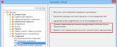

# Более детальные настройки для трассы маршрутизации

В свойстве Топология: Трасса маршрутизации перечислены [сегменты маршрутизации](Glossary_o_strecken.md) топологии, через которые проходят [соединения](Glossary_o_verbindungen.md) или [кабели](Glossary_o_kabel.md), маршрутизируемые в [сети соединенных сегментов](Glossary_o_streckennetze.md). Теперь для [трассы маршрутизации](Glossary_o_verlegewege.md) доступны более детальные [настройки](Glossary_o_einstellungen.md):

* В трассе маршрутизации ранее отображались и неразмещенные [сегменты](Glossary_o_segmente.md) маршрутизации. Неразмещенные сегменты маршрутизации топологии появляются, например, при [генерировании функций топологии](cablinggui_h_strukturenverbinden.md) в точках маршрутизации структурного идентификатора. Теперь неразмещенные сегменты маршрутизации можно скрывать в трассе маршрутизации.
* Кроме того, в трассе маршрутизации ранее не учитывалась длина точек маршрутизации или точек маршрутизации структурного идентификатора топологии. Теперь в трассе маршрутизации можно выводить [точки маршрутизации](Glossary_o_verlegepunkte.md) или [точки маршрутизации структурного идентификатора](Glossary_o_strukturverlegepunkte.md) топологии с соответствующей длиной.

С этой целью в настройках проекта для соединений стал доступен новый флажок Отменить неразмещенные сегменты маршрутизации топологии в трассе маршрутизации и Вывести точки маршрутизации топологии с длиной в трассе маршрутизации. Путь меню для этих настроек: Параметры > Настройки > Проекты > "Имя проекта" > Соединения > Общее.

Эффект:

* С помощью новой настройки проекта Отменить неразмещенные сегменты маршрутизации топологии в трассе маршрутизации в отчетах можно выводить только те трассы маршрутизации, которые размещены на страницах.
* С помощью новой настройки проекта Вывести точки маршрутизации топологии с длиной в трассе маршрутизации в отчетах можно выводить длину в пределах точки маршрутизации.

### Отменить неразмещенные сегменты маршрутизации топологии в трассе маршрутизации:

Если этот флажок установлен, неразмещенные сегменты маршрутизации топологии скрываются в свойстве Топология: Трасса маршрутизации ([ид.](Glossary_o_id.md) 20237) и, таким образом, не выводятся в отчетах.

### Вывести точки маршрутизации топологии с длиной в трассе маршрутизации:

Если этот флажок установлен, точки маршрутизации топологии и точки маршрутизации структурного идентификатора топологии, на которых введена длина, выводятся вместе в свойстве Топология: Трасса маршрутизации (ид. 20237).

Если дополнительно активирована настройка Отменить неразмещенные сегменты маршрутизации топологии в трассе маршрутизации, в трассе маршрутизации выводятся только ***размещенные*** точки маршрутизации топологии и точки маршрутизации структурного идентификатора топологии.

**См. также:**

* [{: .ui-icon }
С вашей помощью мы можем улучшить работу системы. Мы документируем ваши действия в Google Analytics, чтобы постоянно совершенствовать справочную систему ([Дополнительная информация и возможности подачи возражений](helpsystem_hinweise_optout.md)).

Скрыть сообщение
