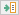

# Диалоговое окно Импортировать настройки: <Путь иерархии>

Параметры > Настройки. Выделите область настройки "Проект" или "Фирма" и щелкните по кнопке {: .ui-icon } (Импортировать).

В этом диалоговом окне определяется, из какого исходного файла будет выполнен импорт настроек.

Обзор основных элементов диалогового окна:

### Исходный файл:

В этом поле выводится путь и имя ранее экспортированного файла. По умолчанию файл экспорта получает имя, которое соответствует выделенной области в дереве диалогового окна Настройки. Имя файла состоит из следующих элементов: <Основная категория>+<Подкатегория>+<Область настройки>.xml. Нажав кнопку ++...++, можно выбрать другой файл импорта.

С помощью пункта всплывающего меню Вставить переменную пути перейдите в диалоговое окно [Выбрать переменную пути](modaldialogsdb_d_pfadvariablen.md), из которого можно будет скопировать одну из доступных переменных пути.

**См. также:**

* [Импорт / экспорт настроек](settingsmastergui_h_importieren_exportieren.md)
* [Настройки: Импорт и экспорт](settingsmastergui_k_import_export.md)
С вашей помощью мы можем улучшить работу системы. Мы документируем ваши действия в Google Analytics, чтобы постоянно совершенствовать справочную систему ([Дополнительная информация и возможности подачи возражений](helpsystem_hinweise_optout.md)).

Скрыть сообщение
