# Генерирование трехмерных видов в пространстве листа с помощью навигационного куба

Вы можете использовать навигационный куб, чтобы генерировать шесть ортогональных и двадцать изометрических видов пространства листа. Управление навигационным кубом осуществляется щелчком мыши при наведении курсора на поверхности, ребра или углы куба. При каждом щелчке навигационный куб поворачивается. Одновременно с этим изменяется вид пространства листа с визуализацией изображения из точек наблюдения, заданных в настоящее время в настройках пространства листа. Кнопки со стрелками  и  справа над навигационным кубом позволяют задать дополнительные виды пространства листа.

!!! tip "Совет:"

    В качестве альтернативы управлению навигационным кубом с помощью мыши, как описано ниже, также можно настраивать различные точки наблюдения и команды для основного представления, используя [комбинации клавиш](gededitgui_k_tastaturbefehle.md). Эти настройки также доступны на вкладке Вид на ленте в группе команд Точка наблюдения 3D.

Условия:

* Вы открыли проект.
* Открыты навигатор пространства листа и пространство листа.
* Пространство листа содержит 3D-объект (или трехмерный чертеж монтажных поверхностей).
* В специфических для пользователя настройках задано основное представление для навигационного куба, например вид "ЮВ изометрия".

1. В открытом пространстве листа щелкните по кнопке {: .ui-icon } под навигационным кубом, чтобы генерировать заданное в настройках основное представление навигационного куба и пространства листа. Альтернативно можно также использовать комбинацию клавиш [Ctrl] \+ [Alt] \+ [8].

!!! info "Для сведения:"

    Навигационный куб повернется в соответствии с заданным в настройках видом.

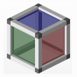

1. С помощью мыши наведите курсор на одну из цветных поверхностей навигационного куба.

!!! info "Для сведения:"

    Эта поверхность будет выделена желтым цветом.

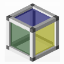

2. Щелкните по этой поверхности.

!!! info "Для сведения:"

    Будет сгенерирован один из ортогональных видов пространства листа. При этом вы будете смотреть на 3D-объект в пространстве листа сверху, снизу, слева, справа, спереди или сзади. В приведенном выше примере изображения вы смотрите на навигационный куб и 3D-объект справа.

!!! info "Для сведения:"

    Рядом с ребрами навигационного куба появятся маленькие треугольные кнопки для каждой поверхности, которая в данный момент не видна.

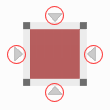

3. Переместите курсор на одну из этик кнопок.

!!! info "Для сведения:"

    Отмеченная кнопка будет выделена желтым цветом.

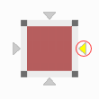

4. Щелкните по одной из отмеченных кнопок.

!!! info "Для сведения:"

    Вид на 3D-объект в пространстве листа и, соответственно, точка наблюдения повернутся на 90° по осям X, Y или Z по часовой стрелке или против часовой стрелки. Вид будет ориентирован по поверхности, на которую указывает треугольник. Используя предыдущий пример изображения, теперь вы смотрите на навигационный куб и 3D-объект сзади.

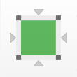

1. Наведите курсор (например, из ортогонального вида) на одно из ребер навигационного куба.

!!! info "Для сведения:"

    Ребро будет выделено желтым цветом.

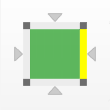

2. Щелкните по этому ребру.

!!! info "Для сведения:"

    Ребро будет выделено желтым цветом.

!!! info "Для сведения:"

    Вид в пространстве листа повернется или наклонится на 45° по часовой стрелке или против часовой стрелки. В таком виде вы будете смотреть на ребро навигационного куба и на 3D-объект в пространстве листа сверху, снизу, слева, справа, спереди или сзади.

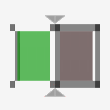

!!! info "Для сведения:"

    3. На навигационном кубе появляются две маленькие треугольные кнопки, которые в зависимости от положения сверху и снизу или слева и справа будут указывать на ось вращения навигационного куба.

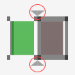

4. Наведите курсор на одну из этик кнопок.

!!! info "Для сведения:"

    Ребро будет выделено желтым цветом.

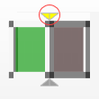

5. Щелкните по кнопке, если вы хотите снова создать ортогональный вид пространства листа.

!!! info "Для сведения:"

    Вид будет ориентирован по поверхности, на которую указывает треугольник. Используя предыдущий пример изображения, теперь вы смотрите на навигационный куб и 3D-объект в пространстве листа сверху.

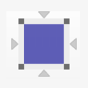

1. Наведите курсор (например, из ортогонального вида) на угол навигационного куба.

!!! info "Для сведения:"

    Угол будет выделен желтым цветом.

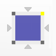

2. Щелкните по этому углу.

!!! info "Для сведения:"

    При этом вы генерируете один из изометрических видов пространства листа. Теперь вы снова смотрите на 3D-объект с одной из основных сторон света (юго-восток, юго-запад, северо-восток, северо-запад). Используя предыдущий пример изображения, теперь вы смотрите на навигационный куб и 3D-объект с северо-востока.

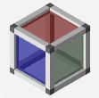

1. Наведите курсор на одну из кнопок со стрелками  или  справа над навигационным кубом.

!!! info "Для сведения:"

    Соответствующая кнопка со стрелкой будет выделена желтым цветом.

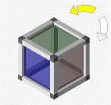

2. Щелкните по кнопке со стрелкой, указывающей вправо.

!!! info "Для сведения:"

    Независимо от установленного последним вида, все пространство листа повернется на 90° влево вокруг установленной в текущий момент зрительной оси.

3. Повторите это действие, используя кнопку со стрелкой, указывающей вправо.

!!! info "Для сведения:"

    Все пространство листа, соответственно, повернется на 90° вправо вокруг установленной в текущий момент зрительной оси.

**См. также:**

* [Навигационный куб](cabinetgui_k_navigationswuerfel.md)
* [Диалоговое окно Настройки: 3D-навигационный куб](gedviewer_d_einstellungennavigationswuerfel3d.md)
