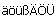

# Синтаксическая проверка ОУ

Устройство обычно содержит всю идентифицирующую информацию (такую как функциональное назначение, место установки, буквенное обозначение) в своем обозначении устройства. Чтобы проверить введенные для ОУ данные на длину и допустимые символы, Вы можете использовать проверку обозначений.

Проверка также осуществляется при вводе идентификаторов в разделе **Управление структ. идентификаторами**. Допустимые символы Вы можете задать в настройках синтаксиса ОУ. Указанные ниже символы не допускаются по умолчанию , если только они не указаны в настройках в качестве допустимых текстовых специальных символов.

Проверка обозначений дает Вам следующие возможности:

* При необходимости Вы можете отключить проверку.
* Вы можете определить различные настройки и допустимые спецсимволы для проверки блоков идентификаторов, обозначений устройств и счетных номеров.
* Eplan также позволяет игнорировать недопустимый символ при синтаксической проверке.

**См. также:**

* [Проверить обозначение устройства](devicetagcheckgui_h_bmueberpruefen.md)
* [Диалоговое окно Настройки: Синтаксическая проверка ОУ](devicetagcheckgui_d_einstellungenprojektbmsyntaxueberpruefung.md)
* [Диалоговое окно Синтаксическая проверка ОУ](devicetagcheckgui_d_syntaxfehlermeldung.md)
