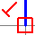
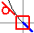

# Захват объекта

Тексты и логические элементы (символы, черные ящики и т. д.) содержат точки вставки. Они отображаются с помощью небольшого заполненного прямоугольника. Графические элементы имеют точки элемента (например, начальные и конечные точки). Они отображаются с помощью небольшого незаполненного прямоугольника.

!!! example "Пример:"

    На следующем рисунке представлены точки вставки (1) и точки элементов (2).

Если Захват объекта активирован в строке состояния с помощью кнопки {: .ui-icon } ( **Вкл. / выкл. захват объекта**), эти точки будут использоваться как точки захвата. В этом случае графические объекты при вставке автоматически привязываются к этим точкам захвата.

Дополнительно к точкам элементов другие точки используются как точки захвата.

* Средние точки линий и сегментов ломаных линий
* Средние точки кругов, дуг и эллипсов
* Точки пересечения элементов.

### Основания перпендикуляра и точки касательной

Если Захват объекта активирован, то при черчении графических элементов у курсора будет отображаться основание перпендикуляра  или точка касательной , как только появится возможность построения вертикального или касательного элемента линии.

Если Захват объекта деактивирован, то эти (и другие) точки не будут использоваться как точки захвата и, следовательно, не будут отображаться.

### Режим перпендикуляра или режим касательной при черчении

Независимо от настройки для Захвата объекта, при черчении определенных графических элементов (линий, окружностей и т. д.) во всплывающем меню доступны оба режима: **Перпендикуляр** и **Касательная**.

С помощью этих функций можно начертить перпендикуляр или касательную линию. Если во всплывающем меню выбран один из этих режимов, у курсора меняется пиктограмма. Соответствующие режимы при этом доступны для следующих графических элементов:

* Режим черчения "Перпендикуляр" (курсор: {: .ui-icon }): для линий, ломаных линий и многоугольников
* Режим черчения "Касательная" (курсор: {: .ui-icon }): для линий, ломаных линий, многоугольников, окружностей, дуг по центру и секторов.

**См. также:**

* [Графический редактор](gededitgui_k_start.md)
* [Активировать захват объекта](gededitgui_h_fangpunkte.md)
* [Начертить перпендикулярные или касательные линии](gededitgui_h_lotrechttangentialzeichnen.md)
