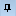
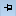
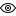

# Диалоговое окно "Виды пространства листа"

## Вызов диалогового окна:

Вы открыли проект. Вы открыли пространство листа.

Диалоговое окно **Виды пространства листа** предназначено для управления видами пространства листа и отображается в виде всплывающего окна рядом с диалоговым окном **Центр вставки**. С помощью кнопок {: .ui-icon } (закрепить) и {: .ui-icon } (открепить) можно определить, должно ли всплывающее окно быть закреплено или откреплено. В открепленном состоянии диалоговое окно **Виды пространства листа** скрыто и видно только как вертикально расположенная вкладка **Виды пространства листа**. По щелчку на эту вкладку диалоговое окно **Виды пространства листа** снова появляется.

Обзор основных элементов диалогового окна:

### Виды, которые относятся к пространству листа

В этой области содержится 10 плиток, на которых можно сохранять ортогональные и изометрические виды для их последующего использования. Ранее вы сгенерировали эти виды для пространства листа, например, с помощью навигационного куба. На каждой плитке отображается предварительное изображение сохраненного вида.

### Панель инструментов

С помощью пиктограмм над плитками можно выполнять следующие действия:

Пиктограмма |  Значение
---|---
{: .ui-icon } |  Добавить текущий вид
{: .ui-icon } |  Удалить вид

### Пиктограммы плиток

На плитке могут находиться следующие пиктограммы:

Пиктограмма |  Значение
---|---
{: .ui-icon } |  Указывает на то, что угол зрения, настроенный в сохраненном виде, также будет применяться при вызове этого вида.
{: .ui-icon } |  Указывает на то, что функциональные элементы и соединения, отображаемые или скрытые в сохраненном виде, также будут отображаться или скрыты при вызове этого вида.

### Всплывающее меню

Для каждой плитки доступно всплывающее меню:

Пункт меню |  Значение
---|---
Угол зрения вкл. / выкл. |  Перед вызовом вида указывает на то, следует ли после вызова сохраненного вида также применять угол зрения, настроенный в этом виде. В соответствии с этим пиктограмма {: .ui-icon } будет показана или скрыта.
Область видимости вкл. / выкл. |  Перед вызовом вида указывает на то, следует ли после вызова сохраненного вида и соединения также показать или скрывать функциональные элементы и соединения, включенные или выключенные в этом виде. В соответствии с этим пиктограмма {: .ui-icon } будет показана или скрыта.
Использовать вид | Применяет в пространстве листа вид, сохраненный на плитке.
Переименовать вид | Позволяет переименовать вид.
Добавить текущий вид | Сохраняет на плитке текущий вид, сгенерированный в пространстве листа.
Удалить вид | Удаляет сохраненный на плитке вид.

**См. также:**

* [Навигационный куб](cabinetgui_k_navigationswuerfel.md)
* [Виды пространства листа](cabinetgui_k_bauraumansichten.md)
* [Управление видами пространства листа](cabinetgui_h_bauraumansichtenverwalten.md)
