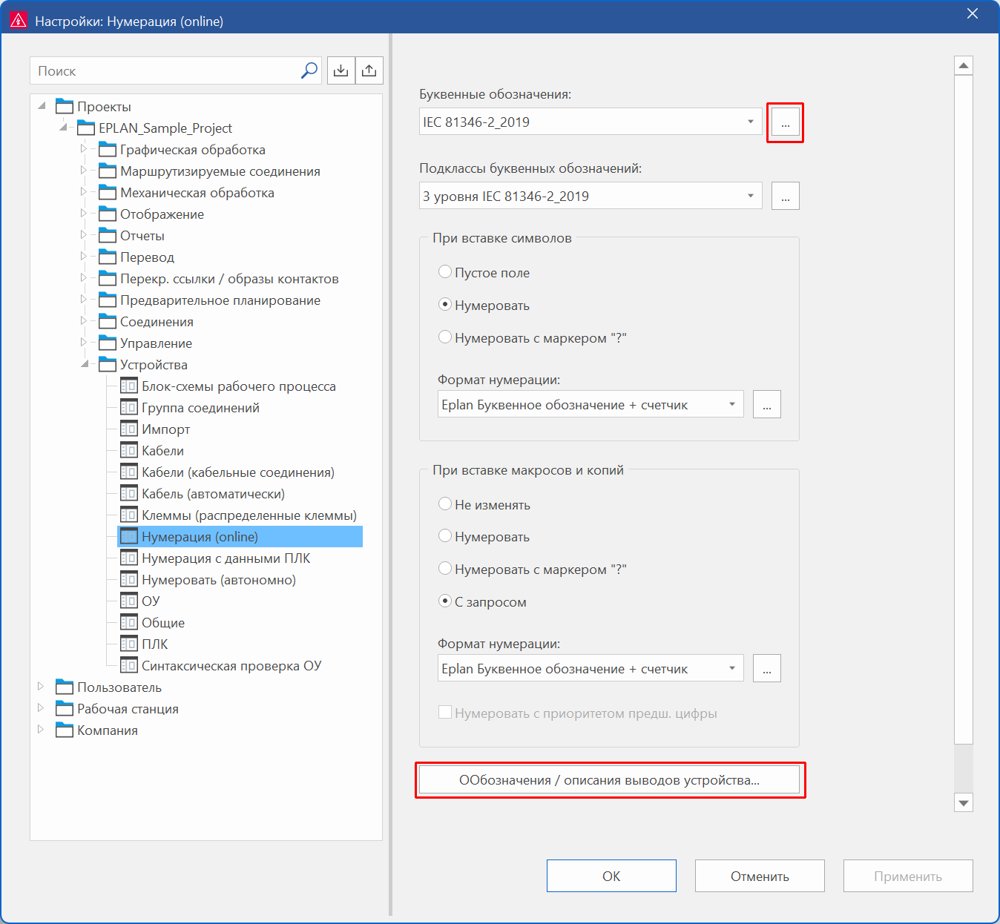

# Наборы буквенных обозначений, обозначения и описания выводов устройства перенесены в настройки проекта

Для улучшения стандартизации, удобства использования и целостности данных в проектах в новой версии также были внесены изменения в библиотеку определений функций. Теперь наборы буквенных обозначений, а также обозначения и описания выводов устройства больше не сохраняются в библиотеке определений функций, а интегрируются непосредственно в настройки проекта.

Эффект:

Сохранение наборов буквенных обозначений, а также обозначений и описаний выводов устройства непосредственно в настройках проекта позволяет избежать специфических для пользователя различий в библиотеках определений функций и обеспечивает согласованность. Централизованное управление в настройках проекта уменьшает сложность и обеспечивает интуитивно понятное использование.

Специфические для проекта схемы и параметры экспорта / импорта обеспечивают гибкость, а новые поля поиска и четко структурированный интерфейс пользователя упрощают работу и экономят время.

Теперь определение наборов буквенных обозначений, а также обозначений и описаний выводов устройства осуществляется не на вкладке **Основные данные** ленты, а в диалоговом окне **Настройки: Нумерация (online)** (командный путь: **Файл** > **Настройки** > **Проекты** > "Имя проекта" > **Устройства** > **Нумерация (online)**).

### Новое диалоговое окно для наборов буквенных обозначений

В рамках этих изменений раскрывающийся список **Текущий набор буквенных обозначений** был переименован в **Буквенные обозначения** и дополнен кнопкой ++"..."++.

* Новое диалоговое окно: Нажав кнопку ++"..."++, вы перейдете в новое диалоговое окно **Буквенные обозначения**, где с помощью техники схем можно создать и редактировать набор буквенных обозначений в виде схемы.
Каждый набор буквенных обозначений сохраняется в отдельной схеме как специфический для проекта. В отличие от прежнего диалогового окна для определения наборов буквенных обозначений, здесь в столбце **Буквенное обозначение** отображаются только буквенные обозначения какого-либо набора.
* Предварительно определенные схемы: Наиболее часто используемые стандарты представляются в виде схем. (Устаревший набор буквенных обозначений "IEC" при использовании сохраняется в старом проекте, но его больше нельзя редактировать.)
* Функции экспорта и импорта: Схемы для наборов буквенных обозначений можно экспортировать и импортировать. Экспортированный файл можно использовать для резервирования данных или для обмена данными.

### Перенесено диалоговое окно для обозначений и описаний выводов устройства

Обозначения и описания выводов устройства также были перенесены из ленты в настройки проекта.

* Новая кнопка: Диалоговое окно **Настройки: Нумерация (online)** было дополнено новой кнопкой ++"Обозначения и описания выводов устройства"++. При нажатии этой кнопки открывается привычное диалоговое окно **Обозначения и описания выводов устройства**.
* Функции экспорта и импорта: Обозначения и описания выводов устройства можно экспортировать и импортировать вместе с настройками проекта в диалоговом окне **Настройки: Нумерация (online)**. При экспорте и импорте назначения определений функций сохраняются.

### Добавление поля поиска

Диалоговое окно **Буквенные обозначения**, а также диалоговое окно **Обозначения и описания выводов устройства** были дополнены полем поиска. Это позволяет целенаправленно фильтровать отображаемые данные в соответствии с определениями функций и быстро уменьшить объем данных.

### Перенос более старых проектов

При переносе проектов из более старых версий наборы буквенных обозначений и обозначения / обозначение / описание вывода устройства, хранящиеся в библиотеках определений функций, автоматически переносятся в настройки соответствующего проекта.
Устаревшие наборы буквенных обозначений "IEC" и "IEC 61346" переносятся только в том случае, если они использовались в проекте.

### Упрощенный интерфейс пользователя

В рамках преобразования библиотек определений функций были убраны некоторые элементы интерфейса пользователя:

* На вкладке **Основные данные** ленты убраны больше неиспользуемые команды **Обозначение вывода устройства** и **Наборы буквенных обозначений**.
* В диалоговом окне **Определения функций** убрано поле **Буквенное обозначение**, поскольку отображаемое в нем буквенное обозначение было взято из устаревшего набора буквенных обозначений "IEC".

**См. также:**

* [{: .ui-icon }
* [{: .ui-icon }
