# Основные данные: Символы

В этом разделе содержится информация о новых и исправленных символах, которые доступны вам в основных данных для текущей версии.

!!! note "Замечание:"

* На следующих страницах вы увидите некоторые представления новых символов из различных библиотек символов. На рисунках изображены соответствующие символы варианта "А" в однополюсном или многополюсном представлении (если отключена настройка проекта **Отображать обозначения выводов устройства в повернутом виде**). Под каждым рисунком приведены имя и номер символа.
* Несколько символов имеют одинаковую графику символов. Однако эти символы различаются между собой относительно применения в разделах, определениях функций, свойствах символов и их позиций. Новые символы, имеющие одинаковую графику, представлены вместе.

Стандарты IEC-, ГОСТ- и GB

## В библиотеки символов были внесены следующие расширения и исправления

* Библиотеки символов IEC_symbol, GOST_symbol и GB_symbol расширены новыми символами. Здесь появились следующие новые символы:

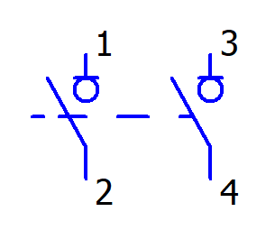 |  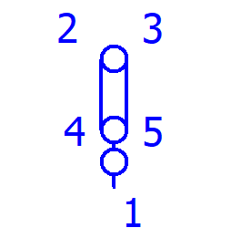 |  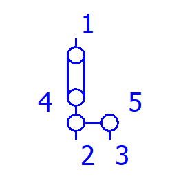 |  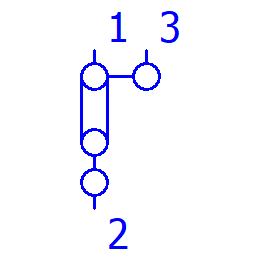
---|---|---|---
QLTR2_1 // 1590 |  XTR3_3 // 1701 |  XTR4_5 // 1702 |  XTR4_6 // 1703
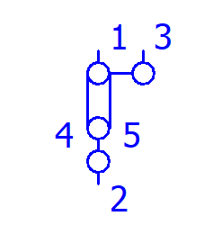 |  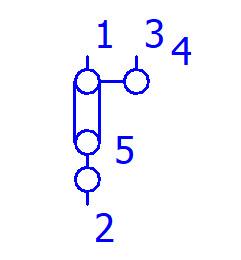 |  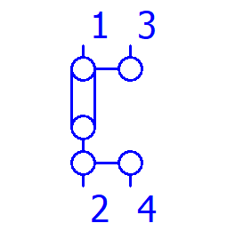 |  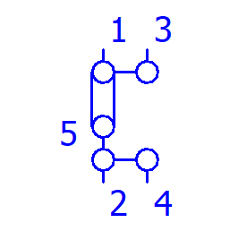
---|---|---|---
XTR4_7 // 1704 |  XTR4_8 // 1705 |  XTR5_5 // 1706 |  XTR5_6 // 1707
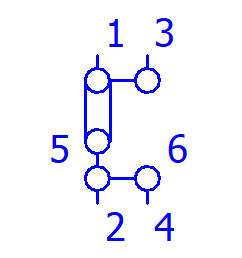 |  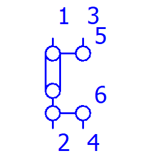
---|---
XTR5_7 // 1708 |  XTR5_8 // 1709

* Библиотеки символов "IEC_single_symbol", "GOST_single_symbol" и "GB_single_symbol" расширена таким новым символом:

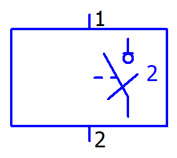

---
QLTR2_1 // 1590

* В библиотеках символов "IEC_single_symbol", "GOST_single_symbol" и "GB_single_symbol" для символов  `SSTO // 1264` и  `SOTS // 1273` вид представления символа исправлен с многополюсного на однополюсный.
* В библиотеках символов "IEC_single_symbol", "GOST_single_symbol" и "GB_single_symbol" заблокированы многочисленные символы для клемм / штекеров, у которых больше двух выводов устройства (например  `XTR3_1 // 1230`,  `X3_1 // 1353` и т. д.).

Стандарт NFPA

## В библиотеки символов были внесены следующие расширения и исправления

* Библиотека символов NFPA_symbol расширена новыми символами. Здесь появились следующие новые символы:

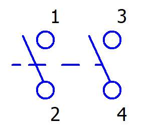 |  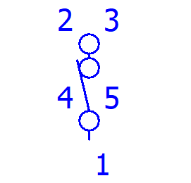 |  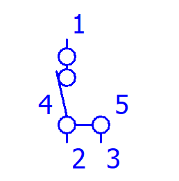 |  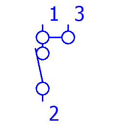
---|---|---|---
QLTR2_1 // 1590 |  XTR3_3 // 1701 |  XTR4_5 // 1702 |  XTR4_6 // 1703
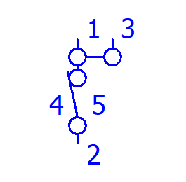 |  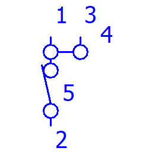 |  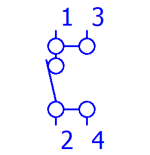 |  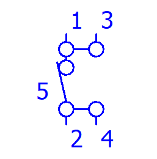
---|---|---|---
XTR4_7 // 1704 |  XTR4_8 // 1705 |  XTR5_5 // 1706 |  XTR5_6 // 1707
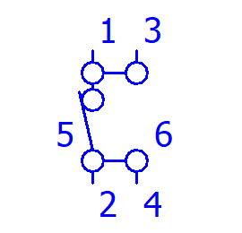 |  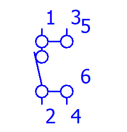
---|---
XTR5_7 // 1708 |  XTR5_8 // 1709

* Библиотека символов "NFPA_single_symbol" расширена таким новым символом:

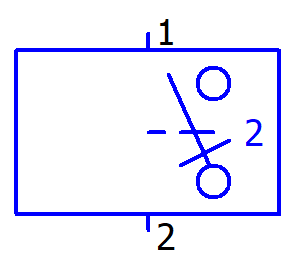

---
QLTR2_1 // 1590

* В библиотеке символов "NFPA_single_symbol" вид представления символа исправлен с многополюсного на однополюсный для следующих символов:
`SSTO // 1264`
`SOTS // 1273`
`XF2 // 1677`
`XR // 1679`
* В библиотеке символов "NFPA_single_symbol" заблокированы многочисленные символы для клемм / штекеров, у которых больше двух выводов устройства (например  `XTR3_1 // 1230`,  `X3_1 // 1353` и т. д.).

Технология производственных процессов и автоматизация зданий

## В библиотеки символов были внесены следующие расширения и исправления

* Библиотека символов PID_ESS расширена новыми символами. Здесь появились следующие новые символы:

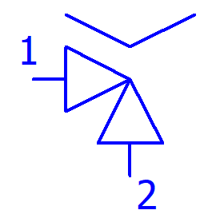 |  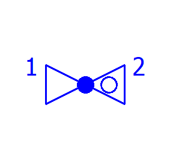 |  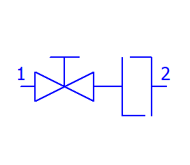 |  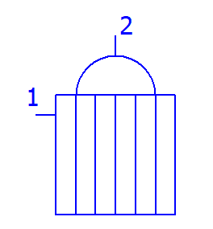
---|---|---|---
V_59 // 497 |  V_60 // 498 |  SA_V_32 // 512 |  WT_48 // 516
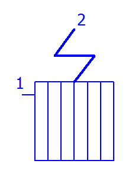 |  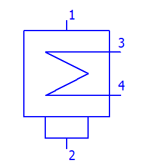 |  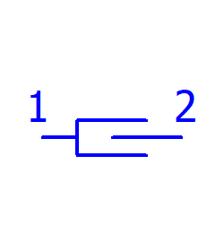 |  
---|---|---|---
WT_49 // 517 |  WT_50 // 518 |  ZUB_61 // 1291 |  ZUB_62 // 1292
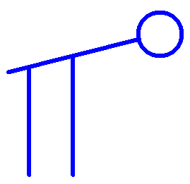 |  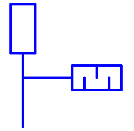 |  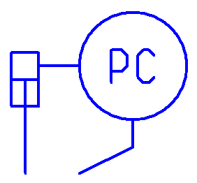 |  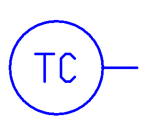
---|---|---|---
STA_11 // 1311 |  STA_12 // 1312 |  STA_13 // 1313 |  STA_14 // 1314

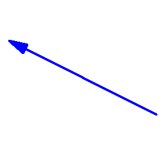

---
STA_38 // 1348

* Библиотека символов "PID_ESS_S50" также расширена этими новыми символами. Библиотека символов содержит те же символы, что и библиотека символов "PID_ESS", но размер символов уменьшен на 50 %.
* В библиотеках символов "PID_ESS" и "PID_ESS_S50" для нескольких символов исправлено соответствующее описание символа.

Fluid-Техника

В библиотеках символов "LUB1ESS", "PNE1ESS", "HYD1ESS" и "HYD2ESS" для некоторых символов исправлено представление выводов устройства.

Библиотеки специальных символов

## В библиотеки символов были внесены следующие расширения и исправления

* В библиотеку символов "SPECIAL" был добавлен новый символ без графики.
`PID54 // 503` // `Функция ТК (без графики)`
* В библиотеке символов "SPECIAL" толщина линии графики для символа  `BPTAG // 337` приведена в соответствие с толщиной линии слоя для автоматического соединения (EPLAN311).
