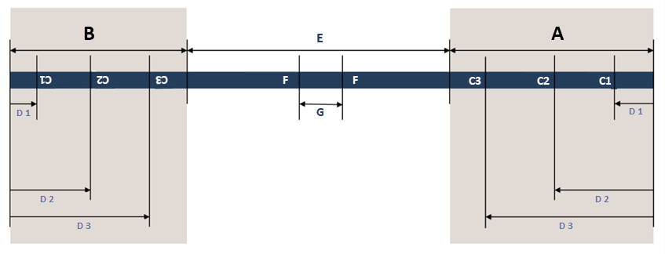
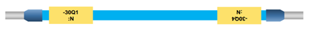

# Вкладка Маркировка

## Вызов диалогового окна:

* **Файл** > **Настройки** > **Фирма** > **Сборка проводов** > "Машина" > вкладка **Маркировка**
* **Файл** > **Экспортировать** > группа команд **Данные изготовления** > **Сборка проводов** > "Машина". Нажмите рядом с полем **Схема** на кнопку ++"..."++. Выберите вкладку **Маркировка**.

На этой вкладке вы определяете информацию о маркировке одиночных жил, которые будут производиться на станке для сборки проводов Schleuniger Easy ProductionServer, Rittal — Wire Terminal WT и Komax — Zeta. Вы определяете интервалы и позиции текстов для печати, выбираете содержание текста, необходимого для обозначения одиночных жил, задаете желаемое форматирование текстов. Во всех трех машинах можно передать до трех различных текстов для маркировки проводов, при этом отдельные позиции могут оставаться пустыми. Все расстояния или значения длины могут быть заданы в единицах мм или дюйм.

## Обзор наиболее важных элементов диалогового окна для Schleuniger — EASY ProductionServer:

### Маркировка начала соединения:

Текст начала соединения проводов.

### Маркировка конца соединения:

Текст конца соединения проводов.

### Маркировка непрерывного текста:

Текст, который постоянно наносится через определенный интервал.

## Обзор наиболее важных элементов диалогового окна для Rittal — Wire Terminal WT:

### Источник печатного текста:

Текст на первом конце провода, подключенного к исходному функциональному элементу.

### Цель печатного текста:

Текст на втором конце провода, подключенного к целевому функциональному элементу.

### Центр печатного текста:

Текст, который может выводиться в центре провода.

## Обзор наиболее важных элементов диалогового окна для Komax — Zeta:

### Уровень иерархии "Одиночная жила":

На этом уровне иерархии задаются настройки для прямой печати одиночных жил:

A |  Начало соединения
---|---
B |  Конец соединения
C1, C2, C3 |  Текст 1, Текст 2, Текст 3
D1, D2, D3 |  Интервал до текста 1, Интервал до текста 2, Интервал до текста 3
E |  Область Непрерывный текст
F |  Непрерывный текст
G |  Интервал текста

!!! note "Замечание:"

    Если вы не вводите единицу измерения, предполагается, что это "мм". Если вы хотите указать длину в дюймах, укажите соответствующую единицу измерения непосредственно. При экспорте будет выполнено преобразование в мм, необходимое для машины.

Напечатать маркировку: установите этот флажок, если тексты должны быть напечатаны непосредственно на одиночных жилах.

Начало соединения / конец соединения:

* Текст 1 — Текст 3: с помощью диалогового окна **Выбрать элементы формата** можно выбрать, какие значения свойств будут использоваться для печати трех возможных текстов в начале и конце соединения одиночных жил, а также задать формат текстов.
* Интервал до текста 1 — Интервал до текста 3: укажите расстояния для трех возможных текстов печати относительно начала и конца соединения одиночных жил.

Напечатать непрерывный текст: если вы хотите, чтобы на одиночных жилах был напечатан текст, который постоянно повторяется с заданным интервалом (непрерывный текст), установите этот флажок.

Непрерывный текст: в поле значения используйте диалоговое окно **Выбрать элементы формата**, чтобы определить, какое значение свойства должно быть напечатано в виде непрерывного текста и в каком формате этот текст должен быть напечатан на одиночных жилах. Можно создать не более 100 символов. Значение по умолчанию составляет 39 символов.

Интервал текста: если маркировка на провод наносится как непрерывный текст, здесь задается интервал между отдельными блоками текста.

От длины соединения: укажите длину, с которой непрерывный текст должен быть напечатан на одиночных жилах.

### Уровень иерархии "Маркировочный шланг":

На этом уровне иерархии можно настроить печать маркировочных шлангов, которые машина накладывает на одиночные жилы в начале и/или в конце соединения:

Напечатать и надвигать: активируйте этот флажок, если на начало и/или конец соединения одиночных жил необходимо надвинуть распечатанный маркировочный шланг.

Начало соединения / конец соединения:

* Текст, строка 1 / Текст, строка 2: с помощью диалогового окна **Выбрать элементы формата** можно выбрать, какие значения свойств будут использоваться в качестве текста для двухстрочной печати маркировочных шлангов в начале и конце соединения одиночных жил, а также задать формат текстов.

Длина шланга: укажите длину маркировочного шланга, который в форме этикетки накладывается на одиночные жилы в начале и в конце соединения.

### Уровень иерархии "Общее":

На этом уровне иерархии задаются общие настройки для печати одиночных жил:

От Направление подсоединения сверху до Направление подсоединения справа: поля для текстов, которые необходимо напечатать на одиночных жилах для обозначения направлений подсоединения.

Максимальное количество символов: введите здесь максимальное количество символов, которое может содержать один текст. Значение по умолчанию составляет 39 символов.

Вращение текста в обратном направлении: печатный текст на одиночных жилах всегда автоматически вращается так, чтобы его можно было читать по горизонтали или справа. Это зависит от вращения функционального элемента и направления подключения одиночных жил к компоненту (слева, справа, сверху или снизу). В зависимости от машины может потребоваться вращение в обратном направлении. В этом случае установите флажок.
