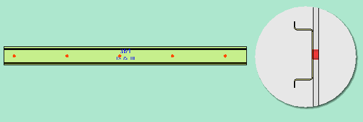

# Изменить 3-мерный вид пространства листа

Вид открытого пространства листа можно изменить при помощи различных функций.

Условия:

* Вы открыли проект.
* Открыты навигатор пространства листа и пространство листа.

Данная функция позволяет перемещать трехмерную модель в трехмерном виде пространства листа.

1. Удерживайте нажатой среднюю клавишу мыши и переместите курсор в требуемом направлении.

!!! info "Для сведения:"

    Трехмерная модель перемещается в направлении движения мыши.

2. Если во время перемещения дополнительно нажать и удерживать нажатой клавишу ++Shift++, перемещение прерывается, а трехмерная модель в пространстве листа поворачивается в направлении движения мыши.

!!! note "Замечание:"

    С помощью настройки пользователя [Средняя кнопка мыши](gedviewer_d_einstellungenbenutzerallgemein3d.htm#MittlereMaustaste) вы задаете действие для средней кнопки мыши — перемещение трехмерной модели в пространстве листа или вращение. Параметр Перемещение и вращение с помощью клавиши ++Shift++ установлен по умолчанию.

Данная функция позволяет увеличить или уменьшить представленное в трехмерном виде пространство листа или изображенные отдельно компоненты (монтажную плату, несущую шину и т. д.).

1. Выберите команды Увеличить фрагмент или Уменьшить фрагмент. (Для этого вам нужно сначала [Настроить ленту](userinterface_h_menuebandanpassen.md) и присвоить нужную команду определенной пользователем группе команд.)

!!! info "Для сведения:"

    Отображаемый вид будет пошагово увеличен или уменьшен относительно позиции в системе координат.

2. Задержите курсор над трехмерным видом и вращайте колесико мыши вперед или назад.

!!! info "Для сведения:"

    Отображаемый вид будет пошагово увеличен или уменьшен относительно позиции курсора.

Данная функция позволяет сгенерировать различные ортогональные (сверху, снизу, слева, справа, спереди или сзади) или [изометрические (с юго-запада, юго-востока, северо-востока, северо-запада) виды](gededit3dgui_k_start.htm#IsometrischeAnsichten) пространства листа. Обозначения четырех изометрических точек наблюдения указывают сторону света, с которой рассматривается модель. Кроме того, угол зрения повернут на 60° вниз.

1. Чтобы повернуть точки наблюдения, используйте [навигационный куб](cabinetgui_k_navigationswuerfel.md) в правом верхнем углу пространства листа. Или выберите следующие команды: Вкладка Вид > группа команд Точка наблюдения 3D > "Точка наблюдения 3D" (например,  "Точка наблюдения 3D, спереди").

!!! note "Замечание:"

    При переключении трехмерной точки наблюдения вид поворачивается и принимает новое положение. Пользовательская настройка [Поворачивать при изменении точки наблюдения](gedviewer_d_einstellungennavigationswuerfel3d.htm#DrehenWechselBlickpunkte) позволяет отключать данную анимацию, в этом случае точка наблюдения изменяется без поворота.

!!! tip "Совет:"

    Для изменения 3D точки наблюдения можно также использовать [комбинации клавиш](gededitgui_k_tastaturbefehle.md). Кроме того, можно назначить эти комбинации клавиш функциональным кнопкам 3D-мыши.

Данная функция позволяет движениями мыши изменить угол зрения на графику.

1. Выберите следующие команды: Вкладка Вид > группа команд Угол зрения > Поворачивать.
Или нажмите в строке состояния на кнопку  (Повернуть угол зрения).

2. Щелкните по трехмерному виду и удерживайте нажатой левую кнопку мыши.
3. Переместите мышь с нажатой кнопкой в направлении, в каком необходимо изменить угол зрения.

!!! info "Для сведения:"

    Представление в пространстве листа последует за указателем мыши и будет повернуто в соответствующем направлении.

Данная функция позволяет уменьшить детализацию графики размещенных в пространстве листа изделий. Функциональные элементы, которые должны быть представлены упрощенно, задаются в диалоговом окне [Настройки: 3D](gedviewer_d_einstellungenbenutzerallgemein3d.htm#VereinfachteDarstellung):

* Клеммники (Определение блока)
* 3D-макросы.

Эти настройки применяются ко всем уже размещенным функциональным элементам и ко всем функциональным элементам, размещаемым позднее.

1. Выберите в навигаторе пространств листов пункт всплывающего меню Упрощенное представление.

!!! info "Для сведения:"

    3D-макросы будут замещены параллелепипедами, размеры которых соответствуют размерам используемых ранее функциональных элементов. Клеммники будут объединены в один блок, отдельные клеммы не представляются. Вместо маркировки отдельных клемм отображается маркировка клеммников. Позиция компонентов, размещенных на этих функциональных элементах, не изменяется.

Предварительно настроенные цвета для фона трехмерного вида можно отрегулировать по отдельности. При этом можно выбрать один цвет или два, между которыми будет сгенерирован горизонтальный градиентный переход.

1. Выберите следующие команды: Файл > Настройки > Пользователь > Графическая обработка > 3D.

2. Нажмите в групповом поле Цветовые настройки в полях Фон оттенения 1 и Фон оттенения 2 на кнопку ++...++, чтобы открыть диалоговое окно [Выбор цвета](mf_d_farbauswahl.md).
3. Выберите необходимые цвета.

!!! info "Для сведения:"

    Если выбрано два различных цвета, фон будет изображен с градиентным переходом цветов. Первый цвет определяет начальный цвет в верхней части окна, второй цвет — конечный цвет в нижней части окна.

!!! info "Для сведения:"

    Если выбрано два одинаковых цвета, фон будет изображен однотонным.

Под Отобразить отверстия понимается отображение всех шагов механической обработки (конструкции). Сюда не относятся монтажные отверстия, размещенные вручную.

1. Активируйте на вкладке Вид в группе команд Пространство листа кнопку Отобразить отверстия.

!!! info "Для сведения:"

    Прозрачность всех размещений изделий настроена на 50 %. Все сохраненные в изделии схемы сверлений отображаются на монтажных поверхностях, на которых они размещены. Визуализированные схемы сверления полностью пропускают расположенные ниже компоненты сверления, что четко видно на виде сбоку.

2. Деактивируйте кнопку Отобразить отверстия, чтобы скрыть отверстия.

**См. также:**

* [Диалоговое окно Свойства (усл. обозначение): Пространство листа](cabinetgui_d_bauraumeigenschaften.md)
* [Диалоговое окно "Пространство листа — <Имя проекта>" / диалоговое окно "Выбор 3D-объекта" / диалоговое окно "Отобразить / скрыть 3D-объекты" / диалоговое окно "Выбрать шаблон интерпретации (специфический для проекта)"](cabinetgui_d_navigator.md)
