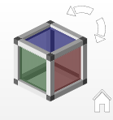

# Навигационный куб

Начиная с версии 2024 в Eplan Pro Panel при просмотре трехмерного чертежа монтажных поверхностей в пространстве листа доступен навигационный куб. Навигационным кубом можно управлять как с помощью мыши, так и с помощью комбинаций клавиш, и он значительно облегчает выбор различных ортогональных или изометрических видов пространства листа.

Навигационный куб предлагает следующие возможности:

* Навигационный куб, отображаемый в правом верхнем углу пространства листа, позволяет быстро изменять виды трехмерного чертежа монтажных поверхностей.
* Можно настроить в общей сложности шесть ортогональных и двадцать изометрических видов.
* Для перехода на другой вид необходимо щелкнуть по поверхности, углу или ребру навигационного куба.
* Отдельная кнопка () под навигационным кубом позволяет перейти в основное представление, которое можно установить в качестве стандартного вида с помощью настроек, определенных пользователем.
* При переходе на ортогональный вид на всех четырех сторонах навигационного куба вверху справа, вверху слева и внизу по центру появляются треугольные кнопки (), с помощью которых можно повернуть вид на 90° в любом направлении по осям X, Y или Z.
* С помощью кнопок со стрелками ( и ), расположенных над навигационным кубом справа, можно повернуть любой выбранный вид на 90° по часовой или против часовой стрелки.
* В зависимости от установленного в данный момент вида поверхности навигационного куба будут окрашены в красный (ось X), зеленый (ось Y) или синий цвет (ось Z).
* В специфических для пользователя настройках можно отобразить или скрыть навигационный куб в пространстве листа, а также настроить его размеры.

* Для управление навигационным кубом можно использовать десять уже известных комбинаций клавиш Eplan Pro Panel для шести ортогональных и четырех изометрических видов. Помимо этого доступны четыре других комбинации клавиш — две для поворота вида на 90° и две для перехода в основное представление и его настройки.

!!! note "Замечание:"

    * В качестве альтернативы навигационному кубу всегда можно настроить ортогональный или изометрический вид трехмерного чертежа монтажных поверхностей, используя пункты меню раскрывающейся кнопки Повернуть угол зрения в строке состояния графического редактора.
    * Если вы активировали функцию Повернуть угол зрения в строке состояния и изменяете угол зрения в пространстве листа с помощью мыши, одновременно с этим будет соответственно поворачиваться и навигационный куб.

**См. также:**

* [Настройка навигационного куба](cabinetgui_h_navigationswuerfeleinstellen.md)
* [Управление навигационным кубом](cabinetgui_h_navigationswuerfelsteuern.md)
* [Диалоговое окно Настройки: 3D-навигационный куб](gedviewer_d_einstellungennavigationswuerfel3d.md)
* [Обзор комбинаций клавиш](gededitgui_k_tastaturbefehle.md)
