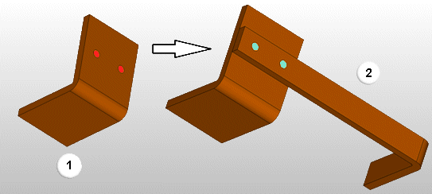
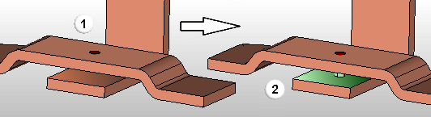

# Унаследовать схему сверления автоматически или вручную

Условие:

Открыт проект, который содержит медные функциональные элементы.

###

## Унаследовать схему сверления автоматически

При оснащении медных функц. элементов можно автоматически передавать ссылки на монтажные отверстия с одного медного функц. элемента на другой. Если медный функциональный элемент размещается на монтажной поверхности другого и в области перекрытия находится монтажное отверстие, то для монтажного отверстия автоматически производится ссылка на новый размещенный медный функциональный элемент. Эта привязка учитывается при отображении сверлений и в экспортах. После разделения обоих медных функциональных элементов методом удаления или перемещения привязанная схема сверления не сохраняется.

Условие:

Активирована настройка **Автоматически несколько монтажных отверстий** (командный путь: **Файл** > **Настройки** > **Пользователь** > **Графическая обработка** > **Изгиб шины** > флажок **Автоматически несколько монтажных отверстий**).

1. Разместите монтажные отверстия, например высверленные отверстия, на монтажной поверхности медного функционального элемента.
2. Разместите второй медный функциональный элемент на монтажной поверхности первого функционального элемента, на которой расположены эти отверстия.

!!! note "Замечание:"

    Следите за тем, чтобы второй функциональный элемент размещался параллельно первому функциональному элементу таким образом, чтобы отверстия первого функционального элемента полностью перекрывались монтажной поверхностью второго медного функционального элемента.

 Отверстия переносятся на второй медный функциональный элемент и там же отображаются.

###

## Унаследовать схему сверления вручную

Кроме автоматического унаследования монтажных отверстий существует возможность последующего переноса монтажных отверстий с одного функц. элемента-шины на другой, уже размещенный.

Условие:

Функциональные элементы размещены параллельно друг другу таким образом, что отверстия функционального элемента - источника полностью перекрыты монтажной поверхностью функционального элемента - цели.

1. Выберите следующие команды: Вкладка **Обработать** > группа команд **Графика** > раскрывающаяся кнопка **Унаследовать схему сверления** > **Обновление многократных пробоев**.
2. Щелчком мыши выберите функц. элемент - источник, с которого вы хотите перенести схему сверления. При этом выбирать можно исключительно медные функциональные элементы.
3. Выберите монтажную поверхность функц. элемента, на которую вы хотите перенести схему сверления.

 Монтажные поверхности функц. элемента - цели при соприкосновении с курсором выделяются цветом. На них отображаются точки захвата и система координат.
4. Щелчком мыши выберите нужную монтажную поверхность.

 Расположение схемы сверления функц. элемента - источника (1) переносится на функц. элемент -цель (2).

!!! note "Замечание:"

    Если в медном жгуте между функциональным элементом - источником и функциональным элементом - целью имеются и другие функциональные элементы, то схема сверления также переносится на эти функциональные элементы. Для этого необходимо, чтобы все функциональные элементы размещались параллельно друг другу, чтобы можно было создать монтажное отверстие через монтажные поверхности всех функциональных элементов.

 Выбор целевого функционального элемента остается активным, и вы можете щелчком мыши выбрать другие монтажные поверхности, чтобы перенести туда схему сверления.

###

## Обновить наследование

На унаследование монтажных отверствии влияют разные действия, которые изменяют медные функц. элементы. Изменение медных функц. элементов может привести к тому, что унаследованные монтажные отверствия не будут отображаться правильно. Если активирована настройка **Автоматическое обновление многократных пробоев**, то обновление будет автоматически выполняться после каждого изменения медных функциональных элементов ( **Файл** > **Настройки** > **Пользователь** > **Графическая обработка** > **Изгиб шины** > флажок **Автоматическое обновление многократных пробоев**).

Однако можно обновить унаследование во всем пространстве листа и вручную.

1. Выберите следующие команды: Вкладка **Обработать** > группа команд **Графика** > раскрывающаяся кнопка **Унаследовать схему сверления** > **Обновление многократных пробоев**.

 В актуальном пространстве листа будут заново рассчитаны все унаследования монтажных отверстий. Выполняется обновление отображения.

**См. также:**

* [Диалоговое окно Настройки: Изгиб шины (пользователь)](cabinetgui_d_einstellungenkupferbiegungbenutzer.md)
