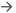
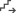

# Диалоговое окно Формат

## Вызов диалогового окна (Форматы для свойств блока):

Вы открыли проект. Открыто диалоговое окно свойств для функции, страницы, символа или проекта. В поле **Свойства** / в поле **Имя свойства** / на вкладке **Свойства** выбрано свойство **Свойство блока: Формат [n]**, а в столбце **Значение** нажата кнопка ++"..."++.

## Вызов диалогового окна (определяемые пользователем свойства):

Вы открыли проект. Вкладка **Инструменты** > группа команд **Управление** > **Свойства**. В диалоговом окне **Конфигурировать свойства** выбрано определяемое пользователем свойство с типом поля "Одноязычный текст" или "Значение с единицей измерения". В поле **Отображаемый тип** вы выбрали запись "Свойство блока", а в поле **Формат блока** нажали кнопку ++"..."++.

## Вызов диалогового окна (шаблон для автоматического выделения):

Вы открыли проект. Проект не защищен от записи. **Файл** > **Настройки** > **Проекты** > "Имя проекта" > **Управление** > **Ревизия (отслеживание изменений)**. Нажмите в поле **Шаблон для автоматического выделения** на кнопку ++"..."++.

## Вызов диалогового окна (формат отображения для определений сегмента):

Вы открыли проект. Вкладка **Предварительное планирование** > группа команд **Обработать** > **Конфигурировать определения сегмента**. Нажмите в поле **Формат отображения навигатора** кнопку ++"..."++.

## Вызов диалогового окна (форматы блока для конфигурации представления структуры дерева):

Вы открыли проект. В дереве навигатора или диалогового окна для изделий выбран пункт всплывающего меню **Конфигурировать представление**. В столбце **Формат блока** щелкните ++"..."++.

В этом диалоговом окне задаются свойства, объединенные в свойстве блока либо отображаемые в автоматическом тексте описания отслеживания изменений, либо которые должны отображаться на сегменте в навигаторе предварительного планирования или на объекте в представлении структуры дерева навигатора.

Обзор основных элементов диалогового окна:

### Доступные элементы формата:

В этом поле представлены доступные элементы формата. Элементы формата могут использоваться частично для навигации и частично для выбора свойств. Возможные операции обозначаются предшествующей пиктограммой.

Пиктограмма |  Значение
---|---
{: .ui-icon } |  Свойство можно выбрать двойным щелчком по элементу формата.
{: .ui-icon } |  С помощью кнопки {: .ui-icon } (Следующая степень) можно перейти от исходного объекта к другим связанным с ним объектам и выбрать косвенные свойства.
{: .ui-icon } |  Можно выбрать свойство (двойным щелчком), а также перейти к другим объектам (с помощью кнопки {: .ui-icon } (Следующая степень)).
{: .ui-icon } |  Группа свойств

Если для элемента формата найдена цель, за элементом формата в скобках отображается идентифицирующее имя цели (например, полное ОУ, полное имя страницы и т. д.). При этом цели можно найти только при определении свойства блока для конкретного объекта, т. е. их невозможно найти, например, при предварительном определении свойств блока в проекте или символе. При определении определяемых пользователем свойств блока цели можно найти, выделив объект (например, функцию на схеме соединений или в навигаторе устройств), а затем открыв диалоговое окно **Формат**.

Нажмите на символ {: .ui-icon }, чтобы открыть группы свойств более низкого уровня. Если от объекта можно перейти к косвенным свойствам последующих объектов, над полем **Навигация** активна кнопка {: .ui-icon } (Следующая степень). Щелкните по ней, и снова отобразится первоначальная группировка свойств – теперь это (косвенные) свойства дополнительного объекта! Если выбирается группа форматов, то кнопка {: .ui-icon } (Переместить направо) активна. В дополнительном диалоговом окне выберите определенное свойство и установите для него форматирование.

При выборе элемента формата с целью, находящейся на странице, в предварительном просмотре графики отображается позиция этой цели на соответствующей странице.

Свойства группируются по-разному в зависимости от объекта:

## Функции

Форматы для свойств блока: для функций свойства сгруппированы следующим образом:

* Функция: Прямые свойства текущей функции. Текущая функция может быть также связана с начальной функцией, которая при навигации находится с помощью {: .ui-icon } (Следующая степень).
* Функциональное присвоение ... Определенная пользователем структура: Свойства структурных идентификаторов.
* Точка определения соединения: свойства точки определения соединения.
* Ссылка изделия: Данные ссылки изделия, скопированные на устройство.
* Изделие: Сохраненные в проекте данные изделия, например номер изделия и номер типа, присвоенные текущей функции.
* Главная функция: Обеспечивает на вспомогательных функциях доступ к косвенным свойствам главной функции (при помощи {: .ui-icon } (Следующая степень)).
* Главная функция вышестоящего устройства: В случае с вложенными устройствами обеспечивает доступ из подчиненного устройства к свойствам главной функции вышестоящего устройства (при помощи {: .ui-icon } (Следующая степень)). Если главная функция не была обнаружена, выводятся свойства первой вспомогательной функции. Чтобы достичь самого вышестоящего устройства у многократно вложенных устройств, необходим многократный переход через {: .ui-icon } (Следующая степень).
* Другие виды представления функции: Если текущая функция несколько раз встречается в проекте (например, в однополюсном и многополюсном представлении), то здесь можно выбрать свойства других видов представления этой функции.
* Другие функции устройства: Для распределенных устройств здесь можно выбрать свойства главной функции (первая запись) и всех вспомогательных функций (все другие записи).
* Главная функция нижестоящего устройства: в случае с вложенными устройствами обеспечивает доступ к данным нижестоящего устройства из главной функции вышестоящего устройства. С помощью индекса и кнопки {: .ui-icon } (Следующая степень) можно получить доступ к свойствам главной функции до 50 нижестоящих устройств. В обычном режиме на этом уровне вы также можете использовать другие элементы формата (например, "Другие функции устройства") для доступа к свойствам остальных функций нижестоящего устройства. Таким образом, например, при наличии двух вложенных блоков ПЛК на внешнем блоке ПЛК можно использовать свойство **Физическая сеть: Адрес шины / номер позиции** для отображения IP-адреса того вывода шины, который размещен в нижестоящем внутреннем блоке ПЛК.
* Группа устройств (прочие функции): Обеспечивает группам устройств доступ из текущей функции к свойствам других функций группы устройств (при помощи {: .ui-icon } (Следующая степень)). Выберите здесь непосредственно запись 'Группа устройств (прочие функции)', при этом будут выведены свойства всех функций группы устройств, за исключением текущей выделенной функции. Выберите запись 'Свойства функции [n]', будут выведены свойства соответствующей функции в группе устройств. Если выделена вспомогательная функция, то с помощью значения индекса '1' можно перейти к многополюсной главной функции, а с помощью других значений индекса — к другим доступным функциям.
* Цель через вывод устройства и номером цели: Предоставляет свойства других функций, которые подсоединяются к текущей функции. Выберите непосредственно здесь запись "Цель через вывод устройства и номером цели", таким образом все цели всех выводов устройства текущей функции будут выдаваться разделенными точкой с запятой. После того как будет выбрана запись "Вывод устройства [n]", все цели этого вывода устройства будут выдаваться разделенными точкой с запятой. В ином случае выберите здесь цель и потом при помощи {: .ui-icon } (Следующая степень) выберите свойства цели.
* Соединение через вывод устройства и номер цели: Свойства соединения, подключенного к текущей функции. Для соединений вывод устройства 1 анализируется как источник, а вывод устройства 2 –как цель.
* Последняя функция через вывод устройства и номер цели (ПЛК): Ищет через отслеживание цели (ПЛК) подсоединенный вывод устройства ПЛК. При этом отслеживается только первая цель (как при поиске символического адреса). Если вывод устройства ПЛК не находится, выдается выбранная в последний раз функция.
* Кабельный вывод сети / шины (однополюсный) устройства: При работе с устройствами ПЛК и подключаемыми к шине устройствами позволяет получить доступ к данным первых пяти однополюсных выводов шины устройства и отобразить их на блоке ПЛК / устройстве. Последовательность выводов шины соответствует отображенной в навигаторе ПЛК. Свободные шаблоны функций также учитываются, чтобы при наложении шаблонов функций не менялась последовательность выводов шины.
* Данные сегмента: Свойства объекта планирования, связанного с функцией.
* Вышестоящее 3D-размещение изделия: Предоставляет доступ к свойствам вышестоящего 3D-размещения изделия в навигаторе пространства листа (через {: .ui-icon } (Следующая степень)).
* Функциональный текст зоны: Предоставляет доступ к соответствующему функциональному тексту зоны (через {: .ui-icon } (Следующая степень)).
* Проводной монтаж: свойства проводного монтажа, которому присвоено соединение.
* Изделие проводного монтажа: свойства первого изделия, внесенного в проводном монтаже. Это изделие, представляющее проводной монтаж.
* Ссылка изделия проводного монтажа: свойства первого внесенного в проводном монтаже изделия, которые можно изменить в проводном монтаже.
* Кабельная сборка: свойства кабельной сборки, которой присвоено соединение.
* Артикул кабельной сборки: свойства первого изделия, внесенного на кабельной сборке. Это то изделие, которое представляет кабельную сборку.
* Ссылка артикула кабельной сборки: свойства первого внесенного на кабельной сборке изделия, которые можно изменить на кабельной сборке.
* Страница: Свойства страницы, на которой находится текущая функция.
* Проект: Свойства текущего проекта.
* Разделитель: Открывает [диалоговое окно Формат: Разделитель](eservicesgui_d_formattrennzeichen.md), в котором задается форматирование для разделителя в группе форматов.
* Комментарий: Открывает [диалоговое окно Формат: Комментарий](eservicesgui_d_formatkommentar.md), в котором можно задать комментарий в пределах группы форматов и с помощью которого документируются настройки формата.
* Вычисление: открывает [диалоговое окно Формат: Вычисление](eservicesgui_d_formatberechnung.md), в котором можно составить расчетную формулу.

## Точки разрыва

Форматы для свойств блока: для точек разрыва свойства сгруппированы следующим образом:

* Точка разрыва: Свойства текущей точки разрыва.
* Точка разрыва (обр. эквивалент): Обеспечивает на точках разрыва по типу звезда доступ к косвенным свойствам различных обратных эквивалентов (при помощи {: .ui-icon } (Следующая степень)).
* Точка разрыва (источник): Обеспечивает доступ к свойствам источника точки разрыва (при помощи {: .ui-icon } (Следующая степень)).
* Цель: Свойства целей, которые подсоединены к точке разрыва.
* Соединение: Обеспечивает доступ к косвенным свойствам соединений, через которые закрываются цели на точках разрыва (при помощи {: .ui-icon } (Следующая степень)).
* Страница: Свойства страницы, на которой находится текущая функция.
* Проект: Свойства текущего проекта.
* Разделитель: Открывает [диалоговое окно Формат: Разделитель](eservicesgui_d_formattrennzeichen.md), в котором задается форматирование для разделителя в группе форматов.
* Комментарий: Открывает [диалоговое окно Формат: Комментарий](eservicesgui_d_formatkommentar.md), в котором можно задать комментарий в пределах группы форматов и с помощью которого документируются настройки формата.
* Вычисление: открывает [диалоговое окно Формат: Вычисление](eservicesgui_d_formatberechnung.md), в котором можно составить расчетную формулу.

## Определения потенциала

Форматы для свойств блока: свойства для точек определения потенциала, выводов потенциала и точек определения сети сгруппированы следующим образом:

* Точка определения потенциала: Свойства текущей точки определения потенциала, текущего вывода потенциала или текущей точки определения сети.
* Страница: Свойства страницы, на которой находится текущая точка определения.
* Проект: Свойства текущего проекта.
* Разделитель: Открывает [диалоговое окно Формат: Разделитель](eservicesgui_d_formattrennzeichen.md), в котором задается форматирование для разделителя в группе форматов.
* Комментарий: Открывает [диалоговое окно Формат: Комментарий](eservicesgui_d_formatkommentar.md), в котором можно задать комментарий в пределах группы форматов и с помощью которого документируются настройки формата.

## Определения трубопроводов

Форматы для свойств блока: свойства для точек определения трубопровода сгруппированы следующим образом:

* Определение трубопровода: свойства текущей точки определения трубопровода.
* Данные сегмента: предоставляет доступ к свойствам вышестоящих сегментов, таким как объекты планирования трубопроводов (с помощью элемента {: .ui-icon } (Следующая степень)).
* Вещество: свойства текущего вещества.
* Класс трубы: свойства текущего класса трубы.
* Страница: Свойства страницы, на которой находится текущая точка определения.
* Проект: Свойства текущего проекта.
* Разделитель: Открывает [диалоговое окно Формат: Разделитель](eservicesgui_d_formattrennzeichen.md), в котором задается форматирование для разделителя в группе форматов.
* Комментарий: Открывает [диалоговое окно Формат: Комментарий](eservicesgui_d_formatkommentar.md), в котором можно задать комментарий в пределах группы форматов и с помощью которого документируются настройки формата.
* Вычисление: открывает [диалоговое окно Формат: Вычисление](eservicesgui_d_formatberechnung.md), в котором можно составить расчетную формулу.

## Автоматические тексты описания

Шаблон для автоматического выделения: для автоматических текстов описания при отслеживании изменений свойства сгруппированы следующим образом:

* Проект: Свойства текущего проекта.
* Разделитель: Открывает [диалоговое окно Формат: Разделитель](eservicesgui_d_formattrennzeichen.md), в котором задается форматирование для разделителя в группе форматов.
* Комментарий: открывает [диалоговое окно Формат: Комментарий](eservicesgui_d_formatkommentar.md), в котором можно задать комментарий в пределах группы форматов и с помощью которого документируются настройки формата.

## Сегменты

Форматы для свойств блока / формат отображения навигатора: для сегментов в предварительном планировании свойства сгруппированы следующим образом:

* Данные сегмента: Свойства сегмента.
* Вышестоящий сегмент структуры: Свойства вышестоящего сегмента структуры.
* Вышестоящий сегмент: Свойства вышестоящего сегмента.
* Нижестоящий сегмент: Свойства нижестоящего сегмента.
* Сегмент структуры, иерархический: Предоставляет доступ к свойствам вышестоящего сегмента структуры на графически размещенном сегменте или функции, связанной с объектом планирования. При этом сегменты структуры можно просмотреть с помощью индекса от самого верхнего узла в дереве навигатора предварительного планирования до последнего сегмента структуры над текущим сегментом.
* Имеется связь с вышестоящими сегментами: Свойства сегментов, под которыми исходный сегмент сохранен в виде связи.
* Связанные сегменты: Свойства сегментов, вставленных под исходным сегментом в виде связи.
* Ссылка изделия: Данные ссылки изделия, скопированные на устройство.
* Изделие: Сохраненные в проекте данные изделия, например номер изделия и номер типа, присвоенные текущей функции.
* Главная функция: Обеспечивает на вспомогательных функциях доступ к косвенным свойствам главной функции (при помощи {: .ui-icon } (Следующая степень)).
* Страница: Свойства страницы, на которой размещен сегмент.
* Проект: Свойства текущего проекта.
* Размещение: В размещенных сегментах предоставляет доступ к свойствам самого размещения (имя страницы, номер столбца и т. д.) и к свойствам страницы через {: .ui-icon } (Следующая степень).
* Объект планирования, трубопровод: Свойства вышестоящего объекта планирования, трубопровод.
* Технологический контур: Свойства вышестоящего технологического контура.
* Функция ТК: Свойства вышестоящей функции ТК.
* Определение трубопровода: в объектах планирования трубопроводов предоставляет доступ к свойствам нижестоящих определений трубопроводов.
* Вещество: в объектах планирования трубопроводов предоставляет доступ к свойствам текущего вещества.
* Класс трубы: в объектах планирования трубопроводов предоставляет доступ к свойствам текущего класса трубы.
* Разделитель: Открывает [диалоговое окно Формат: Разделитель](eservicesgui_d_formattrennzeichen.md), в котором задается форматирование для разделителя в группе форматов.
* Комментарий: Открывает [диалоговое окно Формат: Комментарий](eservicesgui_d_formatkommentar.md), в котором можно задать комментарий в пределах группы форматов и с помощью которого документируются настройки формата.
* Вычисление: открывает [диалоговое окно Формат: Вычисление](eservicesgui_d_formatberechnung.md), в котором можно составить расчетную формулу.

## Объекты в представлении структуры дерева

Форматы блока для конфигурации представления структуры дерева: для объекта, отображаемого в представлении структуры дерева навигатора или диалогового окна для изделий, свойства сгруппированы следующим образом:

* <Объект>: Свойства соответствующего объекта (напр., для объекта "Страница": свойства текущей страницы).
* Разделитель: Открывает [диалоговое окно Формат: Разделитель](eservicesgui_d_formattrennzeichen.md), в котором задается форматирование для разделителя в группе форматов.

Для таких объектов, как "Страница" и "Функция: <…>" дополнительно доступна группа свойств Данные сегмента (со свойствами сегмента).

Для таких объектов навигатора макросов, как "3D-макрос", "Макрос окна" и "Макрос страницы" также доступна дополнительная группа свойств. Например, для объекта "Макрос окна" это группа свойств Рамка макроса (со свойствами соответствующей рамки макроса).

* * *

### Выбранные элементы формата:

Если вы выбрали и отформатировали элементы формата в поле **Доступные элементы формата**, они отобразятся здесь. Выбранные элементы формата отображаются в табличной форме с их обозначением, их символом (например, с номером свойства для выбранных свойств), со схематическим представлением установленного формата (для предварительного просмотра) и, если имеется, их значением.

Если вы открыли диалоговое окно **Формат**, отталкиваясь от выделенного объекта, и выбрали свойство в качестве элемента формата, значения свойств этого объекта отобразятся в столбце **Предв. просмотр**.

!!! example "Пример:"

    Вы выделили функцию на схеме соединений и выбрали элемент формата "ОУ (видимое)".Видимое ОУвыделенной функции отобразится в столбце**Предв. просмотр**.

Последовательность, в которой свойства находятся в списке, определяет их последовательности отображения при выводе свойств блока. Вы можете изменить последовательность с помощью кнопок со стрелками в панели инструментов.

### Навигация:

В этом поле указан путь, который ведет к выбранному свойству. В первой строке выводится определение функции начальной функции. При одном формате в проекте выводится соответствующее имя группы форматов. В следующих строках (для элемента формата, выделенного в поле **Выбранные элементы формата**) отображаются шаги через доступные элементы формата, которые привели к выбору текущего свойства.

!!! example "Пример:"

    Вы выделили клемму и хотите вывести ОУ первой цели, подсоединенной к первому подключению клеммы.Для этого в поле**Доступные элементы формата**выберите записи**Цель через вывод устройства и номер цели > Вывод устройства 1 > Цель 1**и щелкните по кнопке. В поле**Доступные элементы формата**вы можете теперь выбрать свойства клеммной цели. Выберите записи**Свойства функции > Свойства устройства**, и щелкните по. Откроется диалоговое окно**Формат: Свойство блока**; выберите в нем свойство**ОУ (полное)**и щелкните ++"OK"++.Если вы теперь выделяете запись в поле**Выбранные элементы формата**, в поле**Навигация**показывается следующее: `Клемма, 2 выводов устройства Цель через вывод устройства и номером цели, Вывод устройства 1, Цель 1Свойства устройства`

### Панель инструментов:

При помощи кнопок поверх поля **Навигация** пробегите путь к косвенно запрошенным объектам и снова обратно.

Кнопка |  Значение
---|---
{: .ui-icon } (Следующая степень) |  Обеспечивает переход от исходного объекта к другим, связанным с ним объектам, а также выбор косвенных свойств.
{: .ui-icon } (Предыдущая ступень) |  Позволяет переходить от косвенно запрошенного объекта обратно к исходному объекту.

### Предв. просмотр:

(Только для форматов для свойств блока!)

Если вы выбрали и отформатировали свойства в поле **Доступные элементы формата**, здесь можно выполнить предварительный просмотр общего определенного формата. Выбранные элементы формата отображаются с их символическим представлением в порядке, в котором они появляются в поле **Выбранные элементы формата** в списке. Значение в этом поле изменить невозможно.

Если вы открыли диалоговое окно **Формат**, отталкиваясь от выделенного объекта, также отображается результат, который был определен для выбранного объекта.

**См. также:**

* [Диалоговое окно Формат: Свойство блока](eservicesgui_d_formatblockeigenschaft.md)
* [Диалоговое окно Формат: Разделитель](eservicesgui_d_formattrennzeichen.md)
* [Диалоговое окно Формат: Комментарий](eservicesgui_d_formatkommentar.md)
* [Определить свойства блока](blockproperties_h_blockeigenschaftendefinieren.md)
* [Диалоговое окно Конфигурировать представление (дерево)](modaldialogsdb_d_baumkonfiguration.md)
