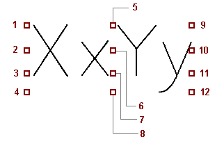

# Вкладка Формат (тексты)

## Вызов диалогового окна в графическом редакторе:

Вы открыли проект. В Графическом редакторе открыта страница проекта.

* Вкладка **Вставить** > группа команд **Текст** > **Текст**.
Или: Вкладка **Главная** > группа команд **Текст** > **Вставить**.
* Вкладка **Вставить** > группа команд **Текст** > **Функциональный текст зоны**.
Или: Вкладка **Главная** > группа команд **Текст** > **Функциональный текст зоны**.
* Вкладка **Вставить** > группа команд **Текст** > раскрывающаяся кнопка **Текст** > **Свойства проекта** или **Свойства страницы**.
Или: Вкладка **Главная** > группа команд **Текст** > раскрывающаяся кнопка **Вставить** > **Свойства проекта** или **Свойства страницы**.
* Вкладка **Вставить** > группа команд **Текст** > **Комментарий**.
* Вкладка **Вставить** > группа команд **Внешн.** > **Графический файл**.
* Вкладка **Вставить** > группа команд **Внешн.** > раскрывающаяся кнопка **QR-код** > **Гиперссылка**.
* Вкладка **Вставить** > группа команд **Внешн.** > **QR-код**.
* Вкладка **Вставить** > группа команд **Указание размеров** > **Отдельный размер** или раскрывающаяся кнопка **Отдельный размер** > "Тип указания размеров".
* Вы выделили текст, текст комментария, специальный текст или функциональный текст зоны и выбрали пункт всплывающего меню **Свойства** либо дважды щелкнули текст, текст комментария, специальный текст или функциональный текст зоны.
* Вы выделили гиперссылку, указание размеров или графический файл и выбрали пункт всплывающего меню **Свойства**.

Выберите в диалоговом окне Свойства / следующем диалоговом окне вкладку **Формат**.

## Вызов диалогового окна в редакторе форм:

Вы открыли проект. Вкладка **Основные данные** > группа команд **Рамки / формы** > раскрывающаяся кнопка **Форма** > **Открыть** > кнопка ++"Открыть"++.

* Вкладка **Вставить** > группа команд **Текст** > **Текст**.
Или: Вкладка **Главная** > группа команд **Текст** > **Вставить**.
* Вкладка **Вставить** > группа команд **Текст** > **Функциональный текст зоны**.
Или: Вкладка **Главная** > группа команд **Текст** > **Функциональный текст зоны**.
* Вкладка **Вставить** > группа команд **Текст** > раскрывающаяся кнопка **Текст** > **Свойства проекта** или **Свойства страницы**.
Или: Вкладка **Главная** > группа команд **Текст** > раскрывающаяся кнопка **Вставить** > **Свойства проекта** или **Свойства страницы**
* Вкладка **Вставить** > группа команд **Текст** > раскрывающаяся кнопка **Формы** > ++"Текст-заполнитель"++.
* Вкладка **Вставить** > группа команд **Рисунок** > **Графический файл**.
* Вкладка **Вставить** > группа команд **Указание размеров** > **Отдельный размер** или раскрывающаяся кнопка **Отдельный размер** > "Тип указания размеров".
* Вы выделили текст, графический файл или указание размеров и выбрали пункт всплывающего меню **Свойства**.
* Вы дважды щелкнули по тексту-заполнителю или специальному тексту (или выбрали пункт всплывающего меню **Свойства**; в этом случае можно выделить несколько текстов).

Выберите в диалоговом окне Свойства / следующем диалоговом окне вкладку **Формат**.

## Вызов диалогового окна в редакторе рамок:

Вы открыли проект. Вкладка **Основные данные** > группа команд **Рамки / формы** > раскрывающаяся кнопка **Рамка** > **Открыть** > кнопка ++"Открыть"++.

* Вкладка **Вставить** > группа команд **Текст** > **Текст**.
Или: Вкладка **Главная** > группа команд **Текст** > **Вставить**.
* Вкладка **Вставить** > группа команд **Текст** > раскрывающаяся кнопка **Текст** > **Свойства проекта** или **Свойства страницы**.
Или: Вкладка **Главная** > группа команд **Текст** > раскрывающаяся кнопка **Вставить** > **Свойства проекта** или **Свойства страницы**
* Вкладка **Вставить** > группа команд **Рисунок** > **Графический файл**.
* Вкладка **Вставить** > группа команд **Указание размеров** > **Отдельный размер** или раскрывающаяся кнопка **Отдельный размер** > "Тип указания размеров".
* Вкладка **Обработать** > группа команд **Рамка** > **Спец. текст**.
* Вкладка **Обработать** > группа команд **Рамка** > раскрывающаяся кнопка **Другие** > **Вставить текст столбца** или **Вставить текст строки** или **Вставить водяной знак**.
* Вы выделили текст, графический файл или указание размеров и выбрали пункт всплывающего меню **Свойства**.
* Вы дважды щелкнули по тексту-заполнителю или специальному тексту (или выбрали пункт всплывающего меню **Свойства**; в этом случае можно выделить несколько текстов).

Выберите в диалоговом окне Свойства / следующем диалоговом окне вкладку **Формат**.

## Вызов диалогового окна в редакторе символов:

Вы открыли проект. Вкладка **Основные данные** > группа команд **Символы** > раскрывающаяся кнопка **Символ** > **Открыть** > кнопка ++"OK"++.

* Вкладка **Вставить** > группа команд **Текст** > **Текст**.
Или: Вкладка **Главная** > группа команд **Текст** > **Вставить**.
* Вкладка **Вставить** > группа команд **Текст** > **Функциональный текст зоны**.
Или: Вкладка **Главная** > группа команд **Текст** > **Функциональный текст зоны**.
* Вкладка **Вставить** > группа команд **Текст** > раскрывающаяся кнопка **Текст** > **Свойства проекта** или **Свойства страницы**.
Или: Вкладка **Главная** > группа команд **Текст** > раскрывающаяся кнопка **Вставить** > **Свойства проекта** или **Свойства страницы**
* Вкладка **Вставить** > группа команд **Рисунок** > **Графический файл**.

Выберите в диалоговом окне Свойства / следующем диалоговом окне вкладку **Формат**.

На этой вкладке обрабатываются свойства просмотра текста. Таким текстом может быть, например, свободно размещенный на странице проекта текст, а также функциональный текст зоны, текст обозначения гиперссылки, указание размеров, специальный текст, текст комментария и т. д.

Обзор основных элементов диалогового окна:

### Свойство / присвоение:

Здесь доступны уровни иерархии **Формат**, **Рамка текста**, **Блок выравнивания**, **Значение / единица измерения**, **Позиция** и **Дата / время**, открыть которые можно, щелкнув по символу { .ui-icon }.

!!! note "Замечание:"

* Для указаний размеров, гиперссылок и графических файлов доступен только уровень иерархии **Формат**. Для графических файлов изменению подлежат только настройки **Слой** и **Невидимый**.
* Для QR-кодов доступен только уровень иерархии **QR-код**.
* Настройки на уровне иерархии **Значение / единица измерения** доступны для обработки только у специальных текстов и текстов-заполнителей.
* Настройки на уровне иерархии **Дата / время** доступны для обработки только у специальных текстов.

* * *

Уровень иерархии Формат

### Выравнивание:

Выберите из раскрывающегося списка требуемое выравнивание текста. Выравнивание указывает, где находится точка ввода относительно текста.

1: Вверху слева 2: В центре слева 3: База слева 4: Внизу слева |   |  9: Вверху справа 10: В центре справа 11: База справа 12: Внизу справа
---|---|---
|  5: Вверху по центру 6: В центре по центру 7: База по центру 8: Внизу по центру |

Для текстов, импортированных из проектов EPLAN 5, имеются дополнительные специальные возможности для выравнивания:

* Спец. слева
* Спец. справа
* Спец. по центру
* JIC спец. слева
* JIC спец. справа
* JIC спец. по центру.

При использовании этих настроек тексты выравниваются так же, как и в EPLAN 5. Тексты перемещаются на 2 мм вниз и, в зависимости от положения текста, на 5 мм по оси X.
Независимо от размера шрифта и угла поворота текст при настройке **Спец. слева** перемещается на 5 мм влево, а при настройке **Спец. справа** — на 5 мм вправо.

!!! note "Замечание:"

    С помощью настройки **Выравнивание** одновременно выравнивается блок выравнивания. Аналогично с помощью настройки **Угол** одновременно поворачивается блок выравнивания. Если блок выравнивания содержит заполнитель или специальный текст для графического символа, он поворачивается на указанный угол, при этом можно использовать любой угол.

### Вид шрифта:

В раскрывающемся списке представлены виды шрифтов, которые были определены в проектных настройках или настройках фирмы. Выберите требуемый вид шрифта.

Виды шрифтов выводятся в списке в той последовательности, в которой они были присвоены видам шрифтов от 1 до 10 в проектных настройках или настройках фирмы. Если изменить вид шрифта в проектных настройках или настройках фирмы, то он автоматически обновляется и в списке.

!!! note "Замечание:"

    При этом заданные в настройках проекта виды шрифтов имеют преимущество перед видами шрифтов, заданными в настройках фирмы.
    Если вид шрифта занесен в настройки проекта, которые отсутствуют на компьютере, соответствующий вид шрифта берется из настроек фирмы.

!!! example "Пример:"

    В настройках проекта определены следующие виды шрифтов:Вид шрифта 1 = TahomaВид шрифта 2 = MS Sans SerifВид шрифта 3 = ArialВид шрифта 4 = SimSun...В раскрывающемся списке эти виды шрифтов выводятся в такой же последовательности. Если выбрать вид шрифта "Arial", текст будет выведен с использованием этого вида шрифта. Теперь измените в настройках проекта вид шрифта 3 на "Courier New". Запись в списке автоматически изменится на "Courier New", и текст будет выведен с использованием измененного вида шрифта.

### Невидимый:

Выберите запись "Да" в раскрывающемся списке, если текст не должен выводиться на странице. Однако он имеется в проекте. Функциональные тексты зон имеются в свойствах соответствующих условных обозначений, где их можно просмотреть. В настройках пользователя определяется, требуется ли выводить и / или распечатывать невидимые элементы (другого цвета).

### Межстрочный интервал:

Данное поле позволяет задать вертикальный интервал между строками текста, т. е. расстояние от нижнего края одной строки до нижнего края другой. Интервал между строками зависит от выбранного вида шрифта. Выберите запись из раскрывающегося списка или введите значение вручную. При этом значение '1' соответствует одинарному интервалу между строками, значение '2' —двойному интервалу между строками и т. д. Одинарный интервал между строками составляет 1,9-кратный размер шрифта (высота прописных букв 'M').

### Язык:

Через этот раскрывающийся список вы указываете, на каком языке должен отображаться текст свойства.

* Все языки отображения (друг под другом): переведенный текст отображается на всех языках, выбранных в групповом поле **Отображение** для поля **Языки** ( **Файл** > **Настройки** > **Проекты** > "Имя проекта" > **Перевод** > **Общее**). Тексты переводов позиционируются на страницах проекта друг под другом.
* Все языки отображения (рядом друг с другом): переведенный текст отображается на всех языках, выбранных в групповом поле **Отображение** для поля **Языки** ( **Файл** > **Настройки** > **Проекты** > "Имя проекта" > **Перевод** > **Общее**). Тексты переводов позиционируются на страницах проекта рядом друг с другом.

!!! note "Замечание:"

    Если на уровне иерархии **Рамка** активирован блок выравнивания, то данная настройка имеет преимущество. Это может привести к тому, что **Все языки отображения (рядом друг с другом)** и **Все языки отображения (друг под другом)** не показывают различия.

* Одноязычн. (перемен.): переведенный текст отображается на языке, выбранном с помощью команд **Файл** > **Настройки** > **Проекты** > "Имя проекта" > **Перевод** > **Общее**.
* Без привязки к языку: эта настройка может использоваться для текстов, которые внесены без привязки к тексту (например, как числовые значения) и не требуют перевода. Если случайно этот текст будет переведен, после этого отобразится пустая запись или текст для отсутствующего перевода (если этот параметр активирован в настройках перевода).
* <Язык>: Переведенный текст выводится на настроенном здесь языке независимо от того, какой исходный язык выбран для данного проекта.

* * *

Уровень иерархии Рамка текста

### Начертить рамку текста:

Посредством этого раскрывающегося списка определяется, будет ли текст обрамлен рамкой и какую форму должна иметь рамка. Предусмотрен выбор следующих опций:

* Из слоя: Текст находится в рамке, если это задано в настройках слоя, на котором находится текст. (Например, в [Управлении слоями](layermanager_d_ebenenverwaltung.md) для соответствующего слоя установлен флажок **Рамка текста**.)
* Прямоугольник: Текст помещается в прямоугольную рамку независимо от настроек слоя.
* Эллипс: Текст помещается в эллипсовидную рамку независимо от настроек слоя.
* Овал: Текст помещается в овальную рамку независимо от настроек слоя. При этом овал обозначается так же, как и прямоугольник, грани которого расширяются двумя полукругами.
* Нет: Текст не помещается в рамку независимо от настроек слоя.

### Размер из настройки проекта:

Если этот флажок установлен, размер рамки текста берется из одноименной специфической для проекта настройки ( **Файл** > **Настройки** > **Проект** > "Имя проекта" > **Графическая обработка** > **Общее**).

Если этот флажок снят, размер рамки зависит от текста.

!!! note "Замечание:"

    В случае с рамкой текста типа "Овал" ее размер, заданный в настройках проекта, будет соответствовать исключительно взятому за основу прямоугольнику. Боковые полукруги не учитываются. Таким образом, овал имеет большую ширину, чем прямоугольник.

### Обновить указательную линию:

Если этот флажок установлен, от текста к соответствующей функции будет проведена указательная линия.

Если флажок не установлен, указательная линия не используется.

Обратите внимание, что при [перемещении текстов свойств](gededitgui_h_symboltexteverschieben.md) с помощью команды **Переместить** будут перемещены и указательные линии (командный путь: вкладка **Главная** > группа команд **Текст** > **Переместить**).

* * *

Уровень иерархии Блок выравнивания

### Активировать блок выравнивания:

Если установлен этот флажок, текст размещается в блоке выравнивания. Другие поля остаются активными и вы можете обработать другие настройки блока выравнивания.

Если флажок не установлен, блок выравнивания не используется. Поля настроек недоступны для обработки и не учитываются при работе.

!!! note "Замечание:"

    Если блок выравнивания активирован, то эта настройка имеет преимущество и учитывается, если для свойства **Язык** выбрана настройка **Все языки отображения (рядом друг с другом)** активированы. Это может привести к тому, что **Все языки отображения (рядом друг с другом)** и **Все языки отображения (друг под другом)** не показывают различия.

### Начертить рамку позиции:

Если установлен флажок **Активировать блок выравнивания**, укажите через этот раскрывающийся список, следует ли отображать графику и, если да, то в какой форме. Выберите здесь "Нет", тогда блок выравнивания станет невидимым.

### Ширина / высота:

В этих полях указывается ширина и высота блока выравнивания. Если эти значения равны нулю, блок выравнивания не определен.

### Ширина текста фиксирована:

Если этот флажок установлен, текст подгоняется по ширине блока выравнивания. Т. е. ширина текста не превышает ширину блока выравнивания. Если текст слишком длинный, он расширяется вниз (или вверх, в зависимости от расположения рамки), а между словами появляются разрывы. Если слово длиннее ширины рамки, разрыв выполняется по центру слова.

### Высота текста фиксирована:

Если этот флажок установлен, текст подгоняется по высоте блока выравнивания. Т. е. высота текста не превышает высоту блока выравнивания. Если текст слишком длинный, строки удлиняются вправо (или влево, в зависимости от способа выравнивания рамок). Определенные пользователем разрывы строк заменяются пробелами. Все пробелы перед переходом на новую строку убираются, а пробелы после перехода на новую строку остаются.

### Убрать переходы на новую строку:

Если этот флажок установлен, определенные пользователем разрывы строк заменяются пробелами. Все пробелы перед переходом на новую строку убираются, а пробелы после перехода на новую строку остаются.

### Никогда не разделять слов:

Если этот флажок установлен, слова, длина которых превышает ширину / высоту блока выравнивания, не разделяются, а выходят за пределы рамки.

!!! note "Замечание:"

    При использовании опции **Выравнивание** (вставка **Формат**) одновременно выравнивается и блок выравнивания. При использовании опции **Угол** (также через свойство **Формат**) одновременно поворачивается и блок выравнивания. Если блок выравнивания содержит заполнитель для графического символа, он поворачивается на указанный угол, при этом можно использовать любой угол.

### Подогнать графику:

Здесь указываются настройки графики в блоке выравнивания. В раскрывающемся списке доступны следующие опции:

* Не подгонять: В этом случае размер графики не меняется; графика, размер которой больше блока выравнивания, выступает из рамки.
* Всегда: При использовании этого параметра графика в блоке выравнивания всегда подгоняется.
* Только если слишком большое: При использовании этого параметра та графика, размер которой превышает размер блока выравнивания, подгоняется таким образом, чтобы не выступать из рамки.

### Разрешен подгон текста:

Если этот флажок установлен, для этого текста разрешается автоматический подгон под блок выравнивания. Условием является то, что, кроме блока выравнивания, активируются также обе настройки **Ширина текста фиксирована** и **Высота текста фиксирована**. В графическом редакторе и редакторе форм подгон текстов осуществляется с помощью команды **Подогнать тексты в блоке выравнивания**. Для текстов-заполнителей в формах при генерировании отчетов подгон выполняется автоматически.

!!! example "Пример:"

    На следующих рисунках показано действие различных настроек на текст в блоке выравнивания. Выводимый текст содержит разрыв строки.Флажок не установлен:Активирована**Ширина текста фиксирована**:Активированы**Ширина текста фиксирована**и**Никогда не разделять слов**:Активированы**Ширина текста фиксирована**и**Убрать переходы на новую строку**:Активированы**Ширина текста фиксирована**,**Никогда не разделять слов**и**Убрать переходы на новую строку**:Активирована**Высота текста фиксирована**(с маленьким блоком выравнивания):Активированы**Ширина текста фиксирована**,**Высота текста фиксирована**,**Разрешен подгон текста**(с маленьким блоком выравнивания):

### Представление:

Доступно только для текстов-заполнителей. С помощью этого раскрывающегося списка для свойства текста-заполнителя можно указать, должно ли значение свойства отображаться в виде QR-кода или изображения вместо представления в виде текста.

Если здесь указано значение "QR-код", то при генерации отчета на основе определенных значений для выбранного выше свойства генерируются QR-коды, которые отображаются на выведенных страницах отчета.

Если здесь указано значение "Графический файл", то для выбранного выше свойства на выведенных страницах отчета отображаются изображения.

При этом размер блока выравнивания определяет размер изображения или QR-кода.

Если нужное представление (например "Графический файл") невозможно для какого-либо текста-заполнителя, то ничего не отображается.

!!! example "Пример:"

    Настройка "QR-код" целесообразна, например, для свойств изделий**Внешний документ: Файл / гиперссылка [1–20]**, чтобы отобразить в отчете гиперссылку внешнего документа в виде QR-кода.Настройка "Графический файл" целесообразна, например, для свойства изделий**Графический файл**, чтобы отобразить на странице отчета графический файл присвоенногоизделия.В технологических контурах можно сохранять графические файлы на вкладке**Документы / страницы**. Эти изображения можно выводить в отчетах для технологических контуров (листов данных). Для этого для данного представления необходимо вставить в соответствующих формах тексты-заполнители со свойствами**Документы: Файл / гиперссылка [1-20]**и настройкой "Графический файл".

* * *

Уровень иерархии Значение / единица измерения

### Отображение единицы измерения:

Для данного свойства по умолчанию настроено "без изменений". При этой настройке свойство отображается так же, как оно было задано в соответствующем поле. Другие настройки на уровне иерархии **Значение / единица измерения** в этом случае недоступны.

Чтобы выбрать другое отображение единицы измерения, нажмите на столбец **Присвоение**, а затем ++"..."++. Откроется алфавитный список физических величин (например, "Давление", "Длина", "Масса" и т. д.) в виде дерева с иерархической структурой. Щелкните символ { .ui-icon }, чтобы открыть требуемый уровень иерархии определенного размера (например, "Мощность"). Двойным щелчком мыши выберите в находящемся ниже уровне иерархии одну из приведенных единиц измерения (например, "МВт"). После этого будут активированы другие свойства отображения на уровне иерархии **Значение / единица измерения**. Все перечисленные для данного размера единицы измерения обозначены здесь как "Группа единиц измерения".

Основные единицы измерения выделены в списке жирным шрифтом. Отображенные здесь размеры и единицы измерения управляются Eplan, и вы не можете их изменять или расширять. При определенных размерах ("Длина", "Масса") вы можете применять единицы отображения из настроек проекта или пользовательских настроек.

!!! note "Замечание:"

    Обратите внимание, что все единицы измерения, не относящиеся к Международной системе единиц (СИ) (т. е., например, "миля", "фут", "унция" и т. д.), основываются на американской системе единиц.

### Отображать:

Посредством раскрывающегося списка укажите, как должно отображаться значение введенной символьной строки и единица измерения:

* Все (стандарт): Отображаются значение и единица измерения.
* Скрыть единицу измерения: Выбранная единица измерения не отображается.
* Скрыть значение: Все значения выбранной единицы измерения будут скрыты. Вместо них будут отображены дополнительные тексты единицы измерения.
* Только первое значение: Отображается только первое значение выбранной единицы измерения.
* Только единица измерения: Отображается только выбранная единица измерения. Значения и дополнительные тексты будут скрыты.

### Десятичные разряды:

В раскрывающемся списке выберите количество выводимых десятичных разрядов.

Можно также скопировать настройку для десятичных разрядов из пользовательской настройки **Единица отображения длины**. Кроме того, список содержит соответствующую запись.

### Переменное число десят. разрядов:

Установите данный флажок, если количество цифр после запятой не должно заполняться нулями; однако число всегда округляется до количества цифр, указанного в поле **Десятичные разряды**.

!!! example "Пример:"

    В поле**Технические параметры**, к примеру, выводится следующее: `Мощность A: 750 Вт, Мощность B: 500 Вт`На вкладке**Отображение**для данного свойства на уровне иерархии**Значение / единица измерения**установлена единица отображения`к Вт`, а в поле**Десятичные разряды**— значение`3`. После того как вы щелкните ++"Применить"++, введенные данные в поле**Технические параметры**останутся неизменными, а в графическом редакторе отобразится следующий текст: `Мощность A: 0,750 к Вт, Мощность B: 0,500 к Вт`

!!! note "Замечание:"

* Если в поле ввода вы указали значение с единицами измерения из двух разных групп единиц измерения, то посредством настроек на уровне иерархии **Значение / единица измерения** вы можете изменять отображение только одной единицы измерения.
* Если в символьной строке не указаны единицы измерения, то основная единица измерения выбранной единицы отображения используется в качестве основы для расчета числовых значений.
* Если единица отображения выбирается из другой группы единиц измерения, отличной от указанной в поле ввода единицы, то для всех значений предполагается, что ввод выполнялся в основной единице измерения выбранной единицы отображения.

!!! example "Пример:"

    В поле**Технические параметры**, к примеру, выводится следующее: `Мощность A: 750 Вт, Мощность B: 500 Вт`Если в качестве единицы отображения установлено`м В`, то программа предполагает, что ввод осуществляется в основных единицах измерения`В`и пересчитывает их в`м В`. В таком случае отображаются обе единицы измерения. Отображение в графическом редакторе выглядит следующим образом: `Мощность A: 750000 м В Вт, Мощность B: 500000 м В Вт`

### Ноль как знак пробела:

Доступно только для свойств с числовыми значениями. Если этот флажок установлен, значение "0" заменяется пробелом.

Такая настройка может пригодиться, например, для порядков свойств или текстов-заполнителей при их использовании в таблицах, в которых не нужно отображать ноль. К примеру, в предварительном планировании это актуально для графического представления схем автоматизации или вывода списков функций для [автоматизации зданий](planninggui_k_gebaeudeautomation.md).

* * *

Уровень иерархии Позиция

!!! note "Замечание:"

* До тех пор пока текст используется как основной для присоединенных текстов, настройки для обоих свойств отображения **Присоединение по умолчанию** и **По центру блока** не имеют значения.
* Для текстов, присоединенных к основному тексту, свойства отображения уровня иерархии **Позиция** недоступны для выбора и не могут быть изменены.

### Присоединение по умолчанию:

Данный раскрывающийся список позволяет задать для основного текста значение по умолчанию для присоединения присоединяемых текстов. Эта настройка действует для всех текстов блока (т. е. для основного текста и присоединенных текстов).

Присоединение по умолчанию| Значение
---|---
Внизу| Если возможно, тексты присоединяются под основным текстом.
Вверху| Если возможно, тексты присоединяются над основным текстом.
Справа| Если возможно, тексты присоединяются справа от основного текста.
Слева| Если возможно, тексты присоединяются слева от основного текста.

### По центру блока:

Данный раскрывающийся список позволяет задать для основного текста необходимость центрирования блока (т. е. основного текста и присоединенных текстов). Блок выравнивается по центру относительно точки вставки основного текста. При центрировании учитываются также интервалы между строчками. Интервал после последнего текста игнорируется.

* Центрирование блока отсутствует: Блок с текстами не центрируется.
* Все тексты: Центрируется весь блок с текстами, т. е. центр блока расположен в точке вставки основного текста.
* Первый текст: Центрируется только первый видимый текст, и к нему добавляются остальные тексты. Центр первого текста находится в точке вставки основного текста.
* Первые два текста: Центрируются два первых видимых текста, а к ним добавляются остальные тексты. Центр первых двух текстов находится в точке вставки основного текста.
* Первые три текста: Центрируются три первых видимых текста, а к ним добавляются остальные тексты. Центр первых трех текстов находится в точке вставки основного текста.

Такое поведение соответствует выравниванию текстов свойств по центру, как описано в разделе [Свойства отображения: Размещенное свойство](devicetaggui_r_anzeigeeigenschaften.md).

### Абсцисса / ордината:

С помощью обоих свойств отображения можно точно задавать позицию текста на странице проекта. При этом данные координат основываются на точке вставки текста относительно исходной точки графической системы координат.

* * *

Уровень иерархии Дата / время

### Формат даты:Формат времени:

По умолчанию для этих свойств установлен параметр "Из настройки проекта". В таком случае для свойства отображения даты / времени, которое размещается как специальный текст, используется формат, заданный в [настройках проекта](xessettingsgui_d_einstellungenprojektdatum.md).

* В раскрывающемся списке **Формат даты**, например, для свойства проекта **День недели** можно выбрать индивидуальный формат даты, к примеру "ГГГГ" для отображения года "2018".
* В раскрывающемся списке **Формат времени** индивидуальный формат времени можно выбрать только для свойства проекта **Время суток**.

* * *

Уровень иерархии QR-код

### Начальная точка:

С помощью двух свойств отображения **Координата X** и **Координата Y** можно точно указать начальную точку QR-кода на странице проекта. При этом данные координат основываются на исходной точке графической системы координат.

### Высота / ширина:

В этом поле задается размер квадрата для QR-кода.

**См. также:**

* [Графический редактор](gededitgui_k_start.md)
* [Обработать свойства текста](gededitgui_h_textebearbeiten.md)
* [Вставить тексты](gededitgui_h_texte.md)
* [Присоединить / отсоединить тексты](gededitgui_h_texteandocken.md)
* [Вставить и обработать функциональные тексты зоны](gededitgui_h_pfadtexteinfuegen.md)
* [Вставить и обработать специальные тексты](formeditorgui_h_sondertexteeinfuegen.md)
* [Вставить и обработать тексты заполнители](formeditorgui_h_platzhaltertexteeinfuegen.md)
* [Вставить QR-код](gededitgui_h_qrcodes.md)
* [Диалоговое окно Настройки: 2D](gedviewer_d_einstellungenbenutzerallgemein.md)
