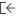
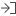

# Диалоговое окно Проводной монтаж — <Имя проекта>

Вы открыли проект.

* Вкладка Соединения > группа команд Проводной монтаж > Навигатор
* Вы открыли редактор, например графический редактор, редактор рамок и т. д. Вкладка Вид > группа команд Навигаторы > раскрывающаяся кнопка Открыть > Проводной монтаж

В этом диалоговом окне отображаются проводной монтаж, кабельные сборки, а также компоненты, содержащиеся в проводном монтаже или в кабельных сборках (соединения, контакты штекера, кабели, изделия и т. д.), и осуществляется управление ими. Через всплывающее меню можно обрабатывать свойства этих компонентов.

Обзор основных элементов диалогового окна:

### Фильтр:

В этом раскрывающемся списке отображаются все доступные фильтры. Выбранный фильтр активируется автоматически и применяется как к дереву, так и к списку. Запись "- Не активировано -" отключает фильтр и приводит к тому, что данные отображаются в неотфильтрованном виде. С помощью кнопки ++...++ откройте диалоговое окно [Фильтр](modaldialogsdb_d_filternnach.md). Здесь можно создать, обработать, удалить, скопировать, экспортировать, импортировать фильтр и управлять им.

Во всплывающем меню раскрывающегося списка Фильтр содержатся следующие записи:

* Выключить: Этот пункт меню доступен, если фильтр установлен: Сбрасывает настройку фильтра до записи "- Не активировано -".
* Активировать <Имя фильтра>: Этот пункт меню доступен, если для настройки фильтра установлено значение "- Не активировано -": Повторно активирует последний активный фильтр.

Таким образом можно быстро переключаться между неотфильтрованным и отфильтрованным в соответствии с требованиями пользователя представлениями.

### Значение: <Свойство>:

При помощи [быстрого ввода](modaldialogsdb_k_filter.md) в данном поле для определенного и активированного фильтра можно быстро изменить значение его критерия.

### Дерево:

Отображает проводной монтаж и кабельные сборки в рамках одного или нескольких проектов в виде иерархической структуры. Верхний уровень иерархии (если открыто несколько проектов) — это проект, под которым отображаются проводной монтаж (пиктограмма ) и кабельные сборки (пиктограмма ). Управление кабельными сборками осуществляется параллельно с проводным монтажом в навигаторе проводного монтажа, и кабельные сборки могут быть частью проводного монтажа или наоборот.

На уровне иерархии ниже (при наличии) расположены первое изделие в рамках проводного монтажа или кабельной сборки, а также компоненты проводного монтажа или кабельной сборки. Компоненты (соединения, кабели, контакты штекера и т. д.) подразделяются на различные уровни иерархии в соответствии с категориями определений функций (пиктограмма ). В других обстоятельствах эти компоненты будут представлены так же, как и в других навигаторах.

Особенности:

* Компоненты, которые внесены как дополнительные изделия в проводном монтаже или в кабельной сборке, отображаются ниже уровня древовидной структуры Прочие компоненты проводного монтажа.
* Для кабельных соединений, представленных под ОУ кабеля, отображается как источник, так и цель (разделенные стрелкой).
* Если изделие на компоненте было определено с помощью свойства Присвоение изделия как деталь принадлежности, оно будет отображаться на дополнительном уровне иерархии (пиктограммы для принадлежностей , изделия (источник) , изделия (цель) ).

### Список:

Отображает проводной монтаж и кабельные сборки в рамках одного или нескольких проектов и компоненты, содержащиеся в проводном монтаже и/или в кабельных сборках, в виде списка. Вид зависит от конфигурации столбцов, выбранной в диалоговом окне Конфигурировать представление.

### Всплывающее меню:

Всплывающее меню дает доступ, в зависимости от типа поля (например, дата, целое число, многоязычный), к пунктам меню, при помощи которых вы можете по необходимости, например, влиять на представление таблиц или обрабатывать значения в полях. Обзор пунктов этого всплывающего меню вы можете найти в разделе [Пункты всплывающего меню](userinterface_m_kontextmenu.md).

Дополнительно здесь представлены следующие пункты всплывающего меню, специфические для данного диалогового окна:

Пункт меню |  Значение
---|---
Создать |  Генерирует новое определение проводного монтажа или новое определение кабельной сборки.
Удалить |  После запроса удаляет все выделенные объекты или — в представлении в виде дерева — все объекты, расположенные ниже выделенного уровня структуры дерева. (Возможный многократный выбор объектов или уровней древовидной структуры.) Одновременно удаляется размещение выделенных объектов в графическом редакторе.
Переименовать (только дерево) |  Позволяет изменить имя проводного монтажа и его соответствующих компонентов или имя кабельной сборки и ее соответствующих компонентов непосредственно в представлении в виде дерева.
Разместить |  Размещает выделенную функцию на схеме соединений. Непосредственно перед размещением нажмите клавишу ++Shift++, чтобы запустить операцию размещения в режиме "Отдельные функции". Нажмите ++Backspace++, чтобы открыть диалоговое окно Разместить устройство и, например, Выбор макросов (при необходимости) или изменить вид представления.
Обработать маркеры ревизий |  Посредством данного пункта меню Вы можете обрабатывать тексты маркировки ревизий и их формат. Пункт меню доступен только в том случае, если в ревизии выделен измененный объект.
Удалить маркер ревизии |  Через этот пункт меню можно удалить тексты маркеров ревизий. Пункт меню доступен только в том случае, если в ревизии выделен измененный объект.
Перейти к (перекрестная ссылка) |  Заносит перекрестные функции в список Перейти к и открывает его.
Перейти к (все виды представлений) |  Заносит все виды представлений функции (например, на странице схем соединений, странице обзора и странице отчета) в список Перейти к и открывает его.
Перейти к (графика) |  Отображает выделенный объект в Графическом редакторе.
Вставить в список результатов поиска |  Позволяет вставить в список результатов поиска все выделенные объекты. Найденные объекты можно снова отобразить в будущем с помощью следующих команд: вкладка Главная > группа команд Поиск > Отобразить результаты.
Список с предварительным выбором (только дерево) |  Уменьшает число отображаемых элементов, чтобы ускорить ориентирование в представлении в виде списка. Если этот параметр активирован, представление в виде списка вызывается с автоматическим фильтром (предварительный выбор), причем этот фильтр содержит только что выбранные элементы.
Выбрать в дереве (только список) |  Показывает выделенный объект во вкладке Дерево.
Табличная обработка |  Открывает табличную обработку с возможностью обрабатывать свойства выделенных объектов.
Свойства |  Открывает диалоговое окно Свойства (усл. обозначение): ++...++. Обеспечивает обработку функции.
Свойства (общие) |  Открывает диалоговое окно Свойства (общие): ++...++. Позволяет обрабатывать свойства устройства.

**См. также:**

* [Проводной монтаж](harnessgui_k_start.md)
