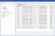

# Улучшение контрольных прогонов для основных данных изделий

Теперь в управлении изделиями у вас есть возможность напрямую проверять основные данные изделий. Для этого можно выполнить контрольные прогоны для основных данных изделий в управлении изделиями, а полученные сообщения теперь будут отображаться не в управлении сообщениями, а непосредственно в управлении изделиями.

В рамках этих изменений зависимые от проекта контрольные прогоны прежнего класса сообщения 501 "Основные данные изделий" были переименованы и перемещены в новый класс сообщения 502 "Основные данные изделий". При этом устаревший контрольный прогон 501019 был убран.

Эффект:

Новое разделение контрольных прогонов позволяет лучше различать в Eplan контрольные прогоны, зависимые от изделий и проекта. Проверка основных данных изделий непосредственно в управлении изделиями, без открытого проекта, стала проще и понятнее.

Больше не требуется указывать объем проверяемых изделий в навигаторе основных данных изделий, который требовался прежде.

Теперь в управлении изделиями можно также проверять данные объектов, которые отсутствуют в навигаторе основных данных изделий, например, дополнительные части.

### Выполнение контрольного прогона в управлении изделиями

Для выполнения контрольного прогона в представлении в виде дерева и в дереве комбинированного представления в управлении изделиями доступен новый пункт всплывающего меню **Выполнить контрольный прогон**. Контрольный прогон выполняется для выбранных изделий.

После выбора пункта всплывающего меню открывается привычное диалоговое окно **Выполнить контр. прогон**. В этом диалоговом окне можно выбрать схему проверки и с помощью кнопки ++"…"++ перейти в диалоговое окно "Настройки" для сообщений. В последующем диалоговом окне **Настройки: Сообщения и контр. прогоны** при вызове в управлении изделиями можно задавать настройки только для сообщений из класса сообщения 502 "Основные данные изделий".

### Новая вкладка "Сообщения"

Результаты контрольных прогонов для основных данных изделий отображаются на новой вкладке **Сообщения**. После выполнения контрольного прогона сначала отображается окно сообщений с количеством сгенерированных сообщений контрольного прогона, а затем автоматически отображается вкладка **Сообщения**. Для отображения этой вкладки необходимо выбрать в древовидной структуре главный узел, например "Изделие".

С помощью пункта всплывающего меню **Перейти к** можно перейти от сообщения к соответствующему изделию.

### Обозначение и фильтрация неверных изделий

После контрольного прогона в управлении изделиями изделия с неверной или неполной информацией обозначаются в древовидной структуре красным восклицательным знаком. Для этого необходимо наличие хотя бы одного сообщения контрольного прогона, относящегося к данному изделию.

Чтобы в древовидной структуре или в списке управления изделиями отображались только изделия, обозначенные как неверные, можно использовать в качестве критерия фильтра переименованное свойство **Имеются сообщения контрольного прогона** (старое название: **Сообщения в управлении сообщениями**).

### Удалить сообщения контрольного прогона

В управлении изделиями под кнопкой ++"Дополнительно"++ появился новый пункт меню **Удалить сообщения контрольного прогона**. После удаления сообщений контрольного прогона для основных данных изделий из базы данных изделий с помощью этого пункта меню появится сообщение с количеством удаленных сообщений.

### Перенос более старых проектов

Раньше контрольные прогоны для основных данных изделий сохранялись в проекте. Если сейчас открыт проект из более старой версии (2025 и старше), и в проекте все еще хранятся "старые" сообщения для основных данных изделий, то — после обновления баз данных проекта — появится запрос, следует ли удалить из проекта эти сообщения из контрольных прогонов изделия.

### Новые контрольные прогоны для основных данных изделий

В классе сообщений 502 "Основные данные изделий" также доступны два новых контрольных прогона:

* С помощью нового тестового прогона 502042 "Файл '\<x\>' не находится в каталоге основных данных '\<z\>', предназначенном для свойства '\<y\>'" можно проверить, находится ли указанный в изделии файл, в каталоге, настроенном для соответствующих основных данных. Если это не так (например, графический файл отсутствует в каталоге, настроенном для изображений), выводится сообщение. Файлы, отсутствующие в настроенных каталогах, невозможно вывести при экспорте данных изделия в формате EDZ.
* Новый контрольный прогон 502043 выдает сообщение, если в каком-либо изделии для свойства указан файл, в котором использование верхнего / нижнего регистра отличается от написания в файловой системе. При этом проверяется как правильность написания имени файла, так и правильность написания пути к файлу. Переменные пути и их содержание, напротив, не учитываются. Если, например, в изделии для свойства **Графический файл** указан файл `Eplan\epl-default-cable.jpg` а в файловой системе имя файла и путь к нему указаны как `C:\Users\Public\EPLAN\Data\Рисунки\<Идентификатор фирмы>\Eplan\EPL-Default-Cable.jpg`, то выводится сообщение.
Унификация написания позволяет предотвратить при обмене данными в формате EDZ многократное сохранение идентичных файлов (изображений, документов и т. д.) в файле EDZ из-за разного использования верхнего / нижнего регистра.

**См. также:**

* [
* [
* [
