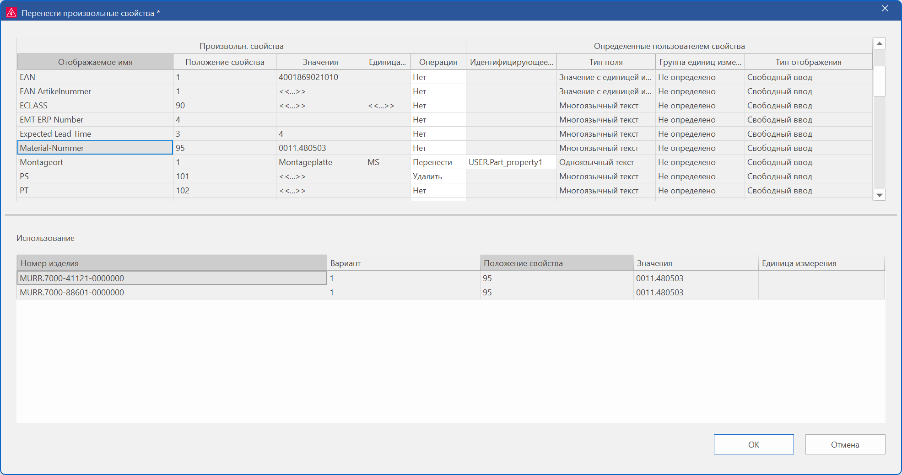

# Перенести произвольные свойства в определенные пользователем свойства

Произвольные свойства доступны в управлении изделиями только для совместимости. Теперь мы оказываем вам поддержку с помощью диалогового окна переноса, позволяющего преобразовать устаревшие произвольные свойства в определенные пользователем свойства или даже удалить их. Поскольку произвольные свойства и определенные пользователем свойства основываются на разных концепциях, такой перенос не может осуществляться автоматически. Поэтому при переносе произвольных свойств необходимо решить, каким образом будет осуществляться этот перенос.

Эффект:

Новое диалоговое окно переноса позволяет поэтапно преобразовать произвольные свойства в более гибкие и лучше настраиваемые определенные пользователем свойства. Благодаря такому переносу исключается необходимость обработки избыточных данных и значительно упрощается управление данными ваших изделий.

### Новое диалоговое окно переноса

Новое диалоговое окно переноса **Перенести произвольные свойства** находится в управлении изделиями в разделе ++"Дополнительно"++ > **Перенести произвольные свойства**.

В этом диалоговом окне вы выбираете произвольные свойства, требуемое действие для соответствующего произвольного свойства (перенести, удалить или нет) и выполняете эти действия.

### Области таблицы

В таблице выше показаны все имеющиеся произвольные свойства. В левой области таблицы **Произвольн- свойства** отображается информация о соответствующем произвольном свойстве, такая как отображаемое имя. В правой области таблицы **Определенные пользователем свойства** отображаются идентифицирующее имя и прочая информация о соответствующем генерируемом или уже имеющемся определенном пользователем свойстве.

Когда в верхней таблице выбирается произвольное свойство, в нижней таблице **Использование** отображаются изделия, которые используют данное произвольное свойство (т.е. которым было назначено это произвольное свойство). Это позволяет более наглядно оценить результаты переноса.

### Возможные действия

Через раскрывающийся список в столбце **Операция** вы указываете, какое действие должно быть выполнено для соответствующего произвольного свойства:

* Нет: Произвольное свойство остается в базе данных изделия в неизменном виде. Выберите этот параметр, если пока не хотите переносить или удалять произвольное свойство.
* Удалить: Произвольное свойство будет удалено в соответствующем изделии. При следующем запуске диалогового окна удаленные произвольные свойства больше не будут доступны.
* Перенести: Произвольное свойство переносится в определенное пользователем свойство. Вы можете либо создать новое определенное пользователем свойство, либо выбрать уже имеющееся. Для этого будет разблокировано поле в столбце **Идентифицирующее имя**, и вы можете ввести новое идентифицирующее имя или с помощью диалогового окна выбора выбрать имя уже имеющегося свойства.
Произвольное свойство не удаляется в результате операции "Перенести" и остается по-прежнему доступным.

Если в качестве операции выбраны записи "Нет" или "Удалить", то поля столбцов в области таблицы **Определенные пользователем свойства** для соответствующего произвольного свойства будут неактивными и не могут быть изменены.

### Выполнение переноса

Когда диалоговое окно переноса закрывается кнопкой ++"OK"++, выполняется перенос для произвольных свойств с выбранной операцией "Перенести". При создании нового определенного пользователем свойства отображаемое имя произвольного свойства становится отображаемым именем нового определенного пользователем свойства.

Независимо от того, создано ли при переносе новое определенное пользователем свойство или использовано существующее, данные переносятся в изделия, использующие это произвольное свойство. Этим изделиям присваивается соответствующее определенное пользователем свойство, и значение произвольного свойства вводится в это определенное пользователем свойство.

**См. также:**

* [{ .ui-icon }
