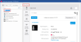

# Отображать Eplan Data Portal в управлении изделиями и для центра вставки

Теперь пиктограмма  "Data Portal" отображается в дереве управления изделиями и в центре вставки. В древовидной структуре и в комбинированном представлении в управлении изделиями эта пиктограмма находится над узлом изделия, а в центре вставки — под пиктограммой  "Макросы окна / символа".

Если нажать на пиктограмму, откроется Eplan Data Portal.

* Управление изделиями: В правой части управления изделиями Eplan Data Portal отображается в виде вкладки в окне браузера.
* Центр вставки: В главном окне платформы Eplan открывается специальное окно для Eplan Data Portal. Несмотря на то, что это окно выглядит как обычное окно Data Portal, оно не зависит от других окон Data Portal и обозначается текстом **Data Portal (центр вставки)** в строке заголовка. Даже если окно Data Portal уже открыто через ленту, все равно будет открыто окно Data Portal для центра вставки.

Эффект:

Теперь благодаря пиктограмме "Data Portal" у вас есть прямой доступ к Eplan Data Portal из управления изделиями, выбора изделий и центра вставки. Это экономит время и значительно упрощает и ускоряет доступ к основным данным. Можно загружать недостающие изделия непосредственно из портала данных Eplan Data Portal, не прерывая текущих рабочий процесс.

Используя новые фильтры поиска в центре вставки, можно выбрать, должен ли поиск выполняться "во всех разделах" (включая Eplan Data Portal) или только в устройствах в управлении изделиями. Такая гибкость позволяет осуществлять поиск, отвечающий индивидуальным требованиям каждого этапа работы, и исключает получение ненужных результатов.

Если подходящее изделие не обнаруживается в управлении изделиями или центре вставки, то поиск автоматически продолжается в Eplan Data Portal. Это сводит усилия к минимуму, поскольку вам не придется вручную переключаться на другую систему, а можно автоматически выполнить поиск по всем доступным источникам.

В целом, благодаря этому работа с изделиями в Eplan становится более эффективной, плавной и менее подверженной ошибкам, что повышает производительность — особенно в сложных проектах с большим количеством изделий.

На новой вкладке или окне Data Portal можно, как обычно, выбрать и скачать основные данные изделий.

Пиктограмма "Data Portal" не имеет всплывающего меню.

* Управление изделиями: Эту пиктограмму нельзя настроить через всплывающее меню **Конфигурировать представление** или через конфигурацию дерева. Пиктограмма отсутствует в представлении в виде списка.
* Центр вставки: Для пиктограммы "Data Portal" не отображаются свойства в информационной области и, соответственно, информационную область также невозможно конфигурировать для данной пиктограммы.

Если поиск в управлении изделиями или в центре вставки не дал результатов, то он будет продолжен – если это возможно – в Eplan Data Portal. Если изделие было там найдено, то оно будет отображаться в Eplan Data Portal. Для этого, при необходимости, открывается Eplan Data Portal. При поиске текст, введенный в поле **Поиск**, также используется для поиска в Eplan Data Portal.

Чтобы пиктограммы Eplan Data Portal отображались и вы могли использовать Eplan Data Portal, необходимо зарегистрироваться в Eplan Cloud. Дополнительную информацию об облачных продуктах Eplan Cloud см. в справке по [Eplan Cloud](https://www.eplan.help/ru-ru/Infoportal/Content/Cloud/Content/htm/Cloud_k_home.htm).

### Новые фильтры поиска для целенаправленного поиска в центре вставки

Теперь при поиске в центре вставки по умолчанию — если это возможно — также выполняется поиск в Eplan Data Portal. Для этого фильтр поиска  (Поиск во всех разделах) дополнен поиском в Eplan Data Portal. Дополнительно доступны следующие новые фильтры поиска:

Кнопка |  Значение
---|---
 (Поиск во всех разделах (кроме Data Portal)) |  Поиск во всех типах объекта. Поиск выполняется только в центре вставки, но не в Eplan Data Portal.
 (Поиск в устройствах и Data Portal) | Поиск выполняется только в устройствах, т.е. в изделиях в управлении изделиями и в Eplan Data Portal.

Чтобы поиск в центре вставки выполнялся также в Eplan Data Portal, необходимо активировать один из фильтров поиска  (Поиск во всех разделах) или  (Поиск в устройствах и Data Portal) перед полем **Поиск**.

Если поиск не должен выполняться в Eplan Data Portal, то перед поиском необходимо нажать одну из других кнопок (например,  (Поиск во всех разделах (кроме Data Portal)).

### Отображать Eplan Data Portal в выборе изделия

Теперь Eplan Data Portal также отображается в выборе изделия. Для этого необходимо активировать специфическую для пользователя настройку **Разрешено изменение при выборе** (командный путь, например,: **Файл** > **Настройки** > **Пользователь** > **Управление** > **Изделие**). После этого в дереве выбора изделия появится пиктограмма  "Data Portal", а в правой части выбора изделия будет отображаться Eplan Data Portal в виде вкладки. Теперь, благодаря этому дополнению при выборе изделия можно искать изделия в Eplan Data Portal и скачивать отсутствующие изделия.

### В Eplan Data Portal не предусмотрен поиск с предварительной фильтрацией изделий

Используя схему фильтра, можно ограничить количество изделий, отображаемых в диалоговых окнах **Управление изделиями**, в навигаторе **Основные данные изделий**, **Выбор изделия**, **Выбор устройства** и **Центр вставки** несколькими конкретными изделиями. Если установлена предварительная фильтрация изделий, то пиктограмма Eplan Data Portal не будет отображаться в управлении изделиями, в выборе изделия и в центре вставки. В этом случае поиск в Eplan Data Portal невозможен.

#### Изменено обозначение предварительной фильтрации изделий

Для более четкого обозначения настроенной предварительной фильтрации изделий были скорректированы заголовки диалоговых окон, относящихся к предварительной фильтрации изделий. Теперь при предварительной фильтрации изделий перед именем базы данных вместо знака процентов "%" размещается текст "(Предварительная фильтрация)" (например, **Управление изделиями - (Предварительная фильтрация) <EPLAN_parts>**). Это относится ко всем приведенным выше диалоговым окнам, за исключением центра вставки. В центре вставки текст "(Предварительная фильтрация)" отображается за папкой "Устройства". Эта идентификация используется как на начальной странице, так и при поиске в центре вставки.

**См. также:**

* [
* [
* [
* [
