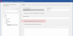

# Указывать локальные форматы для определенных пользователем свойств блока

Теперь в функциях и некоторых других объектах имеется возможность локально указывать собственный отдельный формат блока для определенного пользователем свойства, определенного как свойство блока. Для этого в диалоговом окне **Конфигурировать свойства** на вкладке **Представление** появился новый флажок **Перезаписываемый формат блока на объекте**.

Эта настройка доступна только для типа отображения поля "Свойство блока". Если этот флажок установлен, то в дополнение к определенному пользователем свойству блока генерируется еще одно свойство блока с тем же идентифицирующим именем. Это второе свойство отличается от фактического определенного пользователем свойства блока дополнением "(локальный формат)" в отображаемом имени и возможностью редактирования. Это свойство блока предназначено для определения локального формата блока и может также выбираться для объекта, которому назначено определенное пользователем свойство (например, функция).

Локальный формат блока можно использовать для следующих объектов:

* Точки разрыва
* Функция
* Страница
* Соединение
* Сегменты (предварительное планирование)

Чтобы указать локальный формат блока для объекта, выберите свойство блока для локального формата в таблице свойств. С помощью кнопки ++"…"++ в столбце **Значение** можно перейти в диалоговое окно **Формат** и определить там локальный формат. Затем указанное здесь значение будет также отображаться для соответствующего определенного пользователем свойства блока с тем же идентифицирующим именем.

**См. также:**

* [{ .ui-icon }
* [{ .ui-icon }
