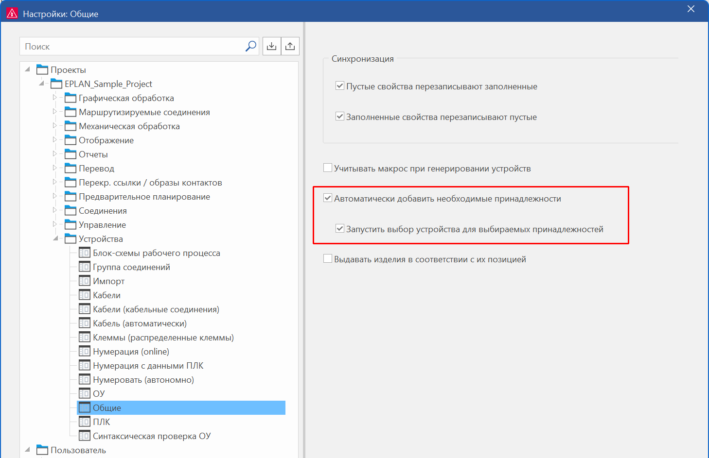
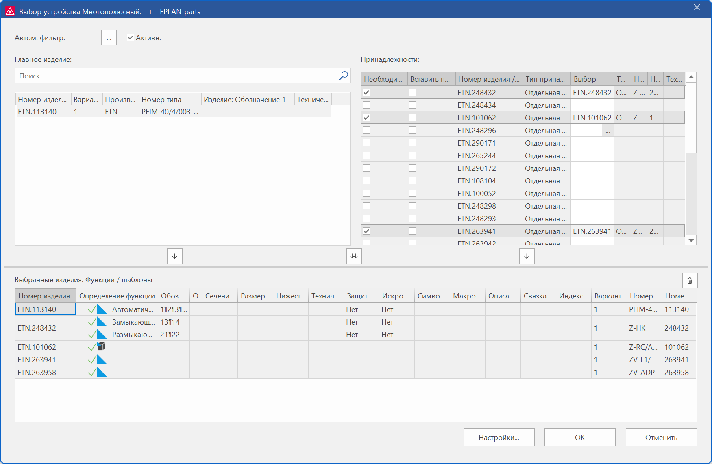

## Расширения для выбора принадлежностей

Для выбора принадлежности в данной версии реализованы следующие возможности:   
\- Автоматически добавить необходимые принадлежности при вставке устройств  
\- Запустить выбор устройства для выбираемых принадлежностей  
\- Вставить полностью список принадлежностей  
\- Многократный выбор при выборе изделий из списка принадлежностей

### Автоматически добавить необходимые принадлежности при вставке устройств

Раньше, если требовалось добавить необходимые принадлежности к устройству, нужно было сначала вставить устройство, затем вызвать выбор устройства и выбрать там принадлежности, после чего разместить принадлежности из навигатора устройств. Чтобы в будущем обеспечить автоматическое добавление изделий принадлежностей к устройству, теперь в настройках проекта доступна новая настройка Автоматически добавить необходимые принадлежности (командный путь: Файл > Настройки > Проекты > "Имя проекта" > Устройства > Общие).

Эффект:

Новая настройка проекта позволяет при вставке или генерировании устройства автоматически добавлять все изделия принадлежностей, отмеченные как "требуется".

Если этот флажок установлен, то при вставке или генерировании устройств будут одновременно автоматически добавляться необходимые принадлежности. Необходимыми принадлежностями являются (отдельные) изделия принадлежностей, для которых в управлении изделиями на вкладке Принадлежности установлен флажок Необходимый. Принадлежности из обязательных списков принадлежностей учитываются только в том случае, если для этого списка принадлежностей активировано новое свойство Вставить полностью список принадлежностей.

* Если устройство вставляется, например, через центр вставки в графическом редакторе, то тогда для размещения предлагаются не только функции этого устройства, но и функции необходимых изделий принадлежностей.
* Если неразмещенное устройство генерируется, например, в навигаторе устройств через пункт всплывающего меню Новое устройство, то к неразмещенной главной функции этого устройства также добавляются шаблоны функций для необходимых принадлежностей.

После вставки или генерирования устройства в диалоговом окне "Свойства" главной функции на вкладке Изделие дополнительно к номеру изделия главной функции также вносятся номера изделий принадлежностей.

Если этот флажок снят, то, как и прежде, устройство вставляется или генерируется без принадлежностей. Это настройка по умолчанию.

#### Запустить выбор устройства для выбираемых принадлежностей

Чтобы облегчить вставку устройств с принадлежностями, даже если эти принадлежности не являются обязательными, в специфических для проекта общих настройках для устройства появилась еще одна новая настройка Запустить выбор устройства для выбираемых принадлежностей. Если установлен флажок Автоматически добавить необходимые принадлежности, то при этом можно указать, следует ли автоматически запускать выбор устройства для выбираемых принадлежностей.

Эффект:

При вставке устройств с выбираемыми принадлежностями можно по желанию запускать автоматический выбор устройства.

Выбираемые принадлежности означают, что у изделия есть как минимум одно изделие принадлежностей, для которого снят флажок Необходимый, или для какой-либо принадлежности речь идет о списке принадлежностей. Списки принадлежностей обычно позволяют выбрать изделие принадлежностей из списка возможных альтернативных вариантов. Обязательные списки принадлежностей, для которых активировано свойство Вставить полностью список принадлежностей, непосредственно добавляются полностью без выбора устройства.

Если этот флажок установлен, то при вставке или генерировании устройств открывается диалоговое окно Выбор устройства. Там уже выбрано подходящее главное изделие. Соответствующее изделие принадлежностей или соответствующие изделия принадлежностей можно выбрать в списке Принадлежности, щелкнув в столбце Выбор и на [...].

Если этот флажок снят, то устройство добавляется только с необходимыми принадлежностями, но без выбираемых принадлежностей.

### Вставить полностью список принадлежностей

Раньше список принадлежностей представлял собой список выбора альтернативных деталей принадлежностей. При выборе устройства из такого списка можно выбрать одно или несколько изделий принадлежностей, подходящих для главного изделия устройства. Однако некоторым пользователям нужно, чтобы при выборе принадлежностей переносились все изделия из списка принадлежностей.

Для этого теперь в списках принадлежностей в управлении изделиями появилось новое свойство Вставить полностью список принадлежностей (ид. 22987). Это свойство доступно для списка принадлежностей на вкладке Свойства под категорией "Настройки".

Эффект:

С помощью свойства Вставить полностью список принадлежностей теперь списки принадлежностей могут автоматически добавляться целиком без необходимости выбора вручную.

Если это свойство активировано, то в диалоговом окне Выбор устройства (в таблице Принадлежности) при нажатии на кнопку [...] в столбце Выбор не открывается диалоговое окно выбора Выбрать принадлежности, а все изделия принадлежностей просто переносятся в поле Выбранные изделия: Функции / шаблоны.

Если это свойство отключено, то, как и прежде, при выборе устройства выполняется выбор принадлежностей из списка принадлежностей.

Чтобы при вставке или размещении устройства все изделия списка принадлежностей добавлялись автоматически, должна быть активирована настройка проекта Автоматически добавить необходимые принадлежности. Тогда, если активировано свойство Вставить полностью список принадлежностей и список принадлежностей для этого изделия отмечен, как "требуется", при вставке изделия в качестве устройства одновременно добавляется весь список принадлежностей.

### Многократный выбор при выборе изделий из списка принадлежностей

Если прежде в управлении изделиями для списка принадлежностей было указано несколько изделий, и при выборе устройства выбиралось изделие с таким списком принадлежностей, то эти изделия приходилось по отдельности выбирать в диалоговом окне Выбрать принадлежности. Теперь в диалоговом окне Выбрать принадлежности также возможен многократный выбор.

Эффект:

Теперь в диалоговом окне Выбрать принадлежности возможен выбор нескольких изделий принадлежностей одновременно.

**См. также:**

* [Диалоговое окно Выбор устройства](partselectiongui_d_geraeteauswahl.md)
* [Диалоговое окно Настройки: Общие (Проекты, Устройства)](xessettingsgui_d_betriebsmittelallgemein.md)
* [Управление изделиями: Управление принадлежностями](articlesgui_k_zubehoerlisten.md)
* [Создать список принадлежностей и присвоить его главному изделию](articlesgui_h_zubehoerlisteerstellen.md)
