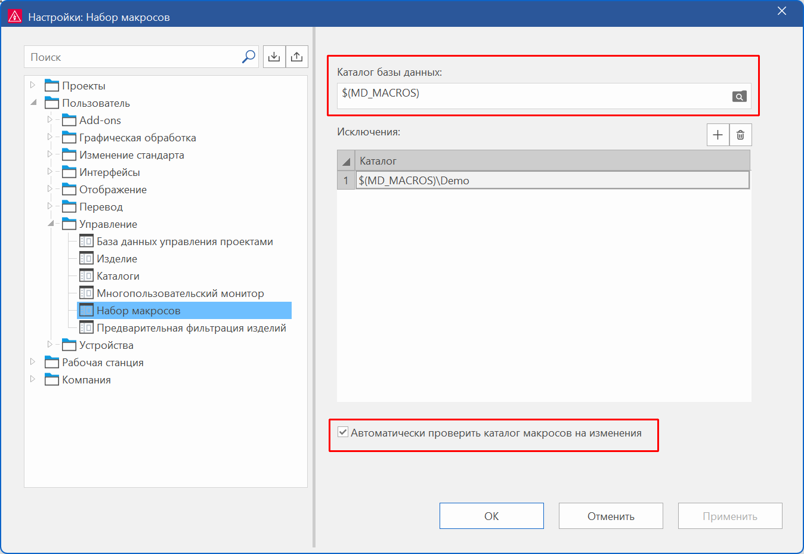

## Указать отдельный каталог для набора макросов

По умолчанию для хранения набора макросов используется каталог макросов, указанный в настройках для каталогов. Теперь при необходимости можно указать другой каталог для набора макросов.

Это может быть полезным, например, если в качестве каталога макросов указан сетевой каталог, к которому может иметь доступ множество пользователей. В таком случае поиск макросов в центре вставки может занимать достаточно много времени. Если указать локальный каталог, отличный от указанного каталога макросов, можно ускорить поиск макросов в центре вставки.

Для указания отдельного каталога для набора макросов диалоговое окно Настройки: Исключения было переименовано в Настройки: Набор макросов, перемещено в настройки пользователя и дополнено новой настройкой Каталог базы данных. Командный путь к этому диалоговому окну: Файл > Настройки > Пользователь > Управление > Набор макросов. Это нововведение доступно начиная с версии 2025, обновления 1.

### Добавления в исключениях для набора макросов

Кроме того, настройка исключений для каталога макросов была перенесена из настроек компании в специфическое для пользователя диалоговое окно "Настройки". Все настройки, связанные с файлами и каталогами, обычно хранятся в настройках пользователя. Это нововведение доступно начиная с версии 2025, обновления 1.  

Раньше в диалоговом окне Настройки: Исключения можно было только выбирать каталоги, но не указывать путь к каталогу вручную или использовать переменные пути. Теперь это возможно в новом диалоговом окне Настройки: Набор макросов для исключений в столбце Каталог. Указанные каталоги макросов не будут отображаться как папки в центре вставки.

### Отключение автоматической проверки каталогов макросов

По умолчанию каталог макросов автоматически проверяется на изменения. Если каталог макросов находится в сети, это может привести к высокой нагрузке на сеть. В таком случае теперь можно отключить эту автоматическую проверку.

Для активации или отключения проверки в диалоговом окне Настройки: Набор макросов доступна новая настройка Автоматически проверить каталог макросов на изменения. По умолчанию этот флажок установлен.

Если флажок снят, то каталоги макросов в сети больше не будут автоматически проверяться на изменения. Изменения, внесенные другими пользователями, или изменения, внесенные в файловые каталоги за пределами Eplan, больше не будут регистрироваться. Если какие-либо изменения вносятся в Eplan вручную (например, создается макрос), то набор макросов все равно будет обновляться автоматически.

Это нововведение доступно начиная с версии 2025, обновления 3.

### Переименованы расширения имен файлов для набора макросов

Теперь расширения имен файлов для набора макросов переименованы с *.mdb и *.mlk на *.emdb и *.emlk, чтобы избежать путаницы с файлами Microsoft Access. Кроме того, начиная с версии 2025 в имя набора макросов добавляется номер версии (например, "Macros_2026.emlk").

**См. также:**

* [Набор макросов для центра вставки](insertergui_k_makrosammlung.md)
