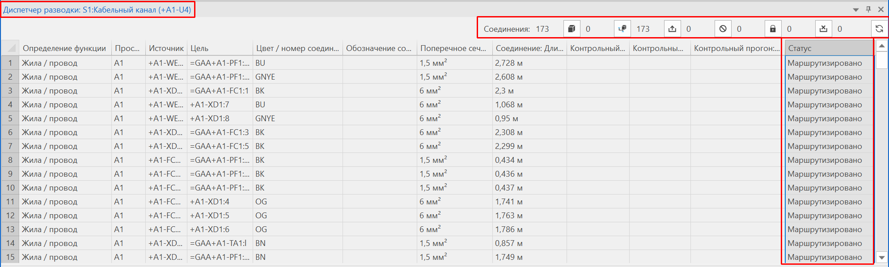

## Новый диспетчер разводки для управления маршрутизируемыми соединениями

Теперь для управления маршрутизируемыми соединениями доступно новое диалоговое окно Диспетчер разводки. В этом диалоговом окне отображаются только те соединения, которые актуальны для маршрутизации и разводки. Для наглядности нарочно скрываются мостовые перемычки и другие виды соединений, не актуальные для маршрутизации в пространстве листа. Кроме того, для лучшей наглядности также не показываются различия между видами представления соединений.

Эффект:

Новое диалоговое окно Диспетчер разводки является центральным местом для получения обзора соединений в пространстве листа, а также для маршрутизации этих соединений и их экспорта для сборки проводов.   
Диалоговое окно также можно использовать для отображения свойств соединений и текущего статуса соединений. Любое изменение соединения вне этого диалогового окна отображается непосредственно в диалоговом окне. Кроме того, статус соединений во время маршрутизации и экспорта обновляется и отображается в диалоговом окне.

Чтобы открыть диалоговое окно Диспетчер разводки, на ленте доступна новая команда. Если у вас открыт проект и пространство листа, откройте диалоговое окно через следующий командный путь: вкладка Обработать > группа команд Маршрутизируемые соединения > Диспетчер.

### Отображение в диалоговом окне

Диалоговое окно реагирует на выбор, сделанный в навигаторе пространства листа, трехмерном навигаторе монтажных поверхностей, навигаторе соединений и т. д. Например, если выделить пространство листа и запустить диалоговое окно Диспетчер разводки, то отображаются все соединения, проходящие в этом пространстве листа. Отображаются только те соединения, определения функций которых учитываются при маршрутизации, а источник и цель как размещение изделия находятся в одном и том же пространстве листа. Соединения между разными пространствами листа не отображаются.

* Строка заголовка: При выборе в навигаторе пространства листа или трехмерном навигаторе монтажных поверхностей в строке заголовка диалогового окна отображается имя первого объекта, включенного в выбор.
* Панель инструментов: На панели инструментов над таблицей отображается количество соединений, перечисленных в таблице. Здесь также имеется несколько кнопок, с помощью которых можно фильтровать отображаемые соединения по статусу, актуальному для маршрутизации или разводки. Так, например, с помощью кнопки  (Маршрутизированные соединения) можно отобразить только те соединения, которые уже маршрутизированы, а с помощью кнопки  (Немаршрутизируемые соединения) – соединения, которые не маршрутизируются. Рядом с каждой кнопкой указывается количество соответствующих соединений.
* Таблица: В таблице в одной строке отображаются свойства соединения, такие как определение функции, источник и цель соединения, а также некоторые свойства соединения. При необходимости можно показать дополнительные столбцы, например, с информацией о трассе маршрутизации или типе потенциала, выбрав пункт всплывающего меню Конфигурировать представление.   
Данные соединения отображаются в соответствии с режимом обработки Свойства (общие), т. е. свойства соответствующего 2D-соединения и 3D-соединения объединяются в одной строке. Свойства в таблице нельзя изменить.

Список соединений можно отфильтровать по пространству листа и электрошкафу посредством выбора в навигаторе пространства листа. Это позволяет обрабатывать каждый электрошкаф по отдельности и уже передавать данные разводки в производство, пока обрабатываются следующие электрошкафы. Эту процедуру можно выполнять последовательно для всех пространств листа, имеющихся в проекте.

Выделенные в диалоговом окне соединения можно экспортировать для сборки проводов (командный путь: Файл > Экспортировать > группа команд Данные изготовления > Сборка проводов). После экспорта статус соединений обновляется и отображается в диалоговом окне.

### Обработка через всплывающее меню

Через всплывающее меню можно для выбранных соединений переходить в двухмерные и трехмерные виды представления соединения или открывать диалоговое окно "Свойства" соединения в режиме обработки Свойства (общие).

Столбцы Источник и Цель позволяют обрабатывать устройства, подключенные к соединению, и поэтому их поведение отличается. Если выбрать какую-либо ячейку в одном из этих столбцов, то во всплывающем меню появятся пункты, позволяющие переходить к источнику или цели соединения. Кроме того, можно дважды щелкнуть здесь, чтобы открыть диалоговое окно "Свойства" соответствующего устройства в режиме обработки Свойства (общие).

Кроме того, всплывающее меню содержит команды, позволяющие непосредственно из диалогового окна маршрутизировать выделенные в этом диалоговом окне соединения или удалить маршрутизацию (т. е. выделенные 3D-соединения).

### Отображение сообщений контрольного прогона

Если во время маршрутизации или экспорта выводились сообщения, то в столбцах Контрольный прогон: Статус, Контрольный прогон: Номер и Контрольный прогон: Текст сообщения отображается статус, номер контрольного прогона и текст первого сообщения, выведенного для этого соединения.

#### Новый контрольный прогон при ошибке маршрутизации

В классе сообщений 026 "Трехмерный чертеж монтажных поверхностей" доступен новый контрольный прогон. Контрольный прогон 026114 "Ошибка маршрутизации: <x>" проверяет для всех соединений, управляемых в диалоговом окне Диспетчер разводки, почему их не удалось маршрутизировать. В ходе этого контрольного прогона выявляются причины, которые ранее выводились только в виде сообщений проекта для источника или цели (в различных пространствах листа), а также причины, по которым прежде еще не было сообщений (защищенные кабели и соединения). Текст сообщения с указанием причины отображается как в диалоговом окне Управление сообщениями, так и в новом диалоговом окне Диспетчер разводки.

**См. также:**

* [Управление маршрутизируемыми соединениями](routinggui_k_verdrahtungsmanager.md)
* [Диалоговое окно "Диспетчер разводки"](routinggui_d_verdrahtungsmanager.md)
