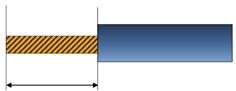
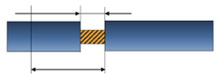
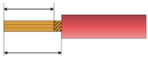
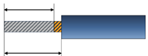

# Вкладка "Обработка концов проводов" (Komax — Zeta)

## Вызов диалогового окна:

* **Файл** > **Настройки** > **Компания** > **Сборка проводов** > **Komax — Zeta** > вкладка **Обработка концов проводов**
* **Файл** > **Экспортировать** > группа команд **Данные изготовления** > **Сборка проводов** > **Komax - Zeta**. Нажмите рядом с полем **Схема** на кнопку ++"..."++. Выберите вкладку **Обработка концов проводов**.

На этой вкладке вы определяете обработку конца проводов машиной.

Обзор основных элементов диалогового окна:

### Панель инструментов:

Кнопка |  Значение
---|---
 (Создать) | Создает новую строку. При этом новая строка добавляется в конце списка.
 (Переместить вверх) /
 (Переместить вниз) | Перемещает выделенные строки на, соответственно, одну позицию вверх или вниз, если это возможно.
 (Обновить) |  Перечитывает обработку концов проводов, назначенную для соответствующих категорий соединений, из соединений в проекте. Информация вводится в столбец **Обработка концов проводов**.
 (Удалить) |  Удаляет выделенные строки.

Таблица:

### Обработка концов проводов:

Введите в поля нужную обработку конца проводов. Если в специфических для проекта настройках для маршрутизируемых соединений (командный путь: **Файл** > **Настройки** > **Проекты** > "Имя проекта" > **Маршрутизируемые соединения** > **Общее**) на одноименной вкладке **Обработка концов проводов** вы назначили обработку концов проводов для возможных конструкций соединений, а затем установили соединения в пространстве листа, то при нажатии на кнопку  (Обновить) на панели инструментов соответствующая информация из соединений будет считываться здесь.

### Машинная команда:

Выберите инструкции для машины, которые должны быть выполнены для выбранной обработки конца проводов.

* Обрезать: при обрезке одиночная жила укорачивается (обрезается) до необходимой пользователю длины.
* Зачистка изоляции: зачистка изоляции подразумевает обрезание части изоляции на обоих соединительных концах одиночной жилы до определенной длины.
* Обжать: при обжиме соединительные концы одиночной жилы неразъемно соединяются с соответствующими соединительными элементами (наконечниками, кабельными наконечниками, контактами штекеров и т. д.) с помощью процесса обжима.
* Залудить: во время лужения жилы зачищенной одиночной жилы спаиваются таким образом, чтобы предотвратить их сращивание.
* Уплотнять: во время уплотнения жилы зачищенной одиночной жилы уплотняются / свариваются с помощью ультразвука, чтобы предотвратить их сращивание.

### До поперечного сечения соединения:

Введите поперечное сечение, до которого должна быть выполнена инструкция, выбранная в поле **Машинная команда**.

!!! note "Замечание:"

    Если вы не вводите единицу измерения, предполагается, что это "мм²". Если вы хотите указать поперечное сечение соединения в AWG, введите соответствующую единицу измерения непосредственно.

### TerminalKey:

Введите здесь "TerminalKey" для каждой одиночной жилы. "TerminalKey" определяет, какие элементы соединения должны быть присоединены к зачищенным соединительным концам одиночных жил с помощью обжима. К ним относятся обжимные контакты, такие как плоские розетки, наконечники для проводов, круглые розетки, контакты для штырей и гнезд, кольцевые кабельные наконечники и т. д.

!!! example "Пример:"

"TerminalKey" — это текст, который определяется как набор параметров, заданный в программных настройках машины Komax, и должен быть взят оттуда.

Максимальная длина текста этого набора параметров составляет 25 символов. Поле **TerminalKey** можно редактировать, только если в поле **Машинная команда** выбран пункт "Обжать".

!!! note "Замечание:"

    Если вы не введете единицу измерения в следующих полях, будет принято значение "мм". Если вы хотите указать длину в дюймах, укажите соответствующую единицу измерения непосредственно. При экспорте будет выполнено преобразование в мм, необходимое для машины.

### Длина зачистки:

Введите длину в миллиметрах, на которую машина должна отрезать изоляцию одиночных жил. Возможны значения максимум до 25 мм. Длина зачистки может быть введена, только если выбрана машинная команда "Зачистка изоляции".

Длина зачистки, введенная на соединениях в свойствах **Длина зачистки источника** (ID 31955) и/или **Длина зачистки цели** (ID 31056), в первую очередь используется для зачистки изоляции. Если значение здесь не введено, зачистка изоляции выполняется с установленной здесь длиной зачистки.

---
Зачистка изоляции |

### Длина частичной зачистки:

Введите длину в миллиметрах, на которую машина должна снять изоляцию с одиночной жилы. Длина частичной зачистки может быть введена только если выбрана машинная команда "Зачистка изоляции".

Если полностью снять изоляцию конца провода, существует риск, особенно при использовании многожильных проводов, что открытые концы расплетутся во время дальнейшей обработки в машине, и что провода больше не смогут проходить через машину.

Чтобы предотвратить это, обрезанный конец лишь слегка оттягивается от проволоки. Отрезанная часть остается на проводе для защиты конца провода и будет убрана при разводке. В зависимости от машины это значение действительно для обоих концов провода.

Длина частичной зачистки всегда должна быть меньше длины зачистки. Если для длины частичной зачистки введено значение, которое больше или равно длине зачистки, появляется соответствующее сообщение.

Частичная зачистка |
---|---

Зачистка изоляции |

### Длина уплотнения:

Введите длину в миллиметрах или дюймах, до которой машина должна уплотнять зачищенные концы соединений одиночных жил. Можно ввести значения от 1 до 15 мм. Длину уплотнения можно ввести, только если выбрана машинная команда "Уплотнять".

Между уплотненным участком и изоляцией должно сохраняться расстояние в 1 мм, которое равно длине зачистки минус длина уплотнения. Это расстояние необходимо для защиты изоляции от повреждений.

Уплотнять |
---|---

Зачистка изоляции |

### Длина лужения:

Введите длину в миллиметрах или дюймах, на которую машина должна залудить зачищенные концы соединений одиночных жил. Можно ввести значения от 1 до 12 мм. Длина лужения может быть введена, только если выбрана машинная команда "Залудить".

Между луженым участком и изоляцией должно сохраняться расстояние в 1 мм, которое равно длине зачистки минус длина лужения. Это расстояние необходимо для защиты изоляции от повреждений.

Залудить |
---|---

Зачистка изоляции |

### Скручивание:

Укажите здесь, нужно ли скручивать зачищенные концы соединений, установив или сняв соответствующий флажок. Скручивание можно активировать только если в качестве машинной команды выбрано "Обжать" или "Залудить".

Скручивание зависит от качества скрутки отдельных проводов, т. е. если голые жилы склонны к сращиванию после зачистки изоляции, то одиночные жилы могут быть скручены с помощью дополнительного модуля на машине. Скручивание возможно только при максимальном поперечном сечении соединения 2,5 мм² или AWG 14.

---

**См. также:**

* [Вкладка Обработка концов проводов](connectionsettingsgui_r_einstellungenverbindungsende.md)
