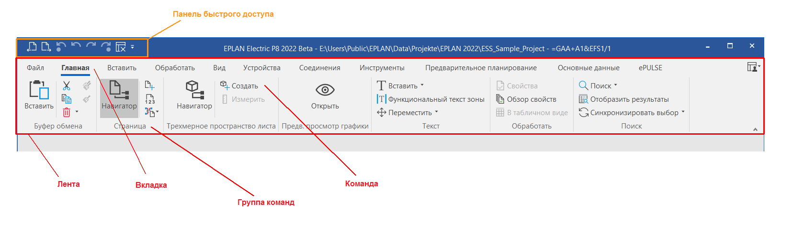
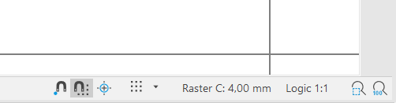

# Элементы интерфейса пользователя

При запуске Eplan открывается с предварительно сконфигурированным пользовательским интерфейсом. Вы можете выбрать светлый или темный дизайн интерфейса пользователя. Соответствующие действия можно выполнить в настройках пользователя интерфейса с помощью настройки **Дизайн интерфейса**.

Вы можете настроить стандартный вид интерфейса пользователя в соответствии с собственными потребностями. Диалоговые окна, например навигатор страниц, которые вы часто используете для обработки данных, можно оставить на экране Eplan на необходимый период времени, отсоединив их от главного окна Eplan.

Можно спозиционировать любое из этих "окон" (в отсоединенном состоянии) и любое другое диалоговое окно на любом месте на экране, потянув строку заголовка диалогового окна при нажатой левой кнопке мыши в требуемую позицию.

Если вы настроили пользовательский интерфейс Eplan для определенной задачи проектирования, вы можете сохранить эту конфигурацию (позиция, размеры и настройки присоединяемых диалоговых окон) в качестве рабочей области и использовать ее в дальнейшем по мере необходимости.

### Лента

Под строкой заголовка главного окна Eplan находится лента с командами, необходимыми вам для обработки устройств, страниц проекта, основных данных и т. п. В ленте функции программы расположены в нескольких вкладках.

Вкладки ленты разделены на распределенные в зависимости от задач группы команд, благодаря чему вы сможете легче найти нужные команды. Так, например, вкладка **Главная** содержит следующие группы команд: **Буфер обмена**, **Сторона**, **Трехмерное пространство листа**, **Предв. просмотр графики**, **Текст**, **Обработать** и **Поиск**.

Вы можете изменять ленту и добавлять в нее собственные вкладки, группы команд и — через API Addins — собственные команды. Если вам нужно больше место в главном окне или отсоединенном редакторе, вы можете также свернуть ленту.

#### Контекстнозависимые вкладки

Вкладки **Вставить**, **Обработать** и **Вид** являются контекстнозависимыми, они отображаются только после открытия редактора. В данных вкладках вам предоставляются разные группы команд и команды в зависимости от редактора.

В случае отсоединения редактора вам будут доступны контекстнозависимые вкладки в окне редактора в виде отдельной ленты.

Если вы настраивали ленту, в отсоединенных редакторах будут отображаться только команды в ленте, присвоенные категориям "Вставить", "Редактировать" и "Вид" и содержащиеся во вкладках **Вставить**, **Обработать** и **Вид**. Определенные пользователем вкладки, команды из других категорий, а также операции там будут скрыты. При этом можно, например, во вкладку **Обработать** ввести команду категории "Вид".

#### Поле поиска "Поиск команды"

Используя поле поиска "Поиск команды" в ленте, вы можете быстро найти функции, необходимые в текущей ситуации. Вам уже знакомо такое поле поиска по продуктам Microsoft Office. При вводе поискового запроса (например, "Страница") под полем отображается список с соответствующими командами (например, **Навигатор**, **Создать**, **Нумеровать** и т. д.). При выборе команды открывается соответствующее диалоговое окно (например, для команды **Создать** диалоговое окно **Новая страница**).

При наведении курсора на какой-либо из элементов списка появляется всплывающая подсказка с описанием данной команды. Там также отображается категория (вкладка) и группа команд, в которой данная команда может по умолчанию находиться в ленте. Эта информация также позволит вам быстрее находить нужные команды при настройке ленты.

## Дополнительные сведения о всплывающей подсказке

* Категория (вкладка) и группа команд отображаются для команд, которые видны на ленте.
Пример команды **Точка определения потенциала**: [Вставить | Кабели / соединения]
* Для команд, расположенных в виде кнопок в "галерее" (например, символов соединения в **Галерее символов**), также отображается группа галереи.
Пример команды **Точка разрыва**: [Вставить | Символы | Символы соединения]
* Для команд, доступных в виде Backstage, также отображаются область команд и группа команд.
Пример команды **Экспортировать графический файл**: [Файл | Экспортировать | Данные проекта | Страница]
* Для команд, доступных в строке состояния (например, **Вкл. / выкл. захват сетки**), отображается следующее: [Строка состояния].
* Для команд, которые по умолчанию не отображаются на ленте, отображается текст "[Настроить ленту... | Другие команды (<Категория>)]".
Пример для команды **Макросы из файлов 3D**: [Настроить ленту... | Другие команды (основные данные)]
* Для команд, которые были добавлены на ленту пользователем, путь к настроенной команде отображается в новой строке в дополнение к стандартному пути к команде.

Отсоединенный редактор также имеет такое поле поиска. Поскольку лента зависит от контекста, можно найти только команды, доступные в ленте в текущей ситуации.

#### Уменьшение главного окна

Когда вы уменьшаете размер главного окна Eplan, лента уменьшается таким образом, чтобы у вас и далее имелся доступ ко всем командам. Для этого в некоторых командах убирается текст, отображается только пиктограмма. Кроме того группы команд уменьшаются до кнопок, в которых доступ к командам обеспечивается через раскрывающиеся списки.

Если главное окно еще больше уменьшается, в конце концов отображается только часть ленты. В таком случае вы можете двигать отображаемую часть ленты влево-вправо при помощи кнопки в правой или левой части ленты.

!!! example "Пример:"

    Кнопка слева и справа для перемещения ленты при сильно уменьшенном окне.

#### Раскрывающиеся списки с командами

Для экономии места некоторые команды расположены в ленте под другими кнопками. Вы распознаете из по маленькой стрелке { .ui-icon }, находящейся рядом с кнопкой или под названием группы команд. Если щелкнуть по стрелке, появится раскрывающийся список с дополнительными командами.

!!! example "Пример:"

    Различные кнопки с раскрывающимися списками:Разделяемая кнопка:на самой кнопке находится важная команда, под стрелкой расположены другие команды (например, вкладка**Главная**> группа команд**Буфер обмена**> раскрывающаяся кнопка**Удалить**).Раскрывающаяся кнопка:на кнопке отсутствует команда, она предназначена для группирования расположенных под ней команд (например, вкладка**Главная**> группа команд**Страница**> раскрывающаяся кнопка**Макрос страницы**).Уменьшенная группа команд:для экономии места группы команд уменьшаются до одной кнопки с расположенными под ней командами (например, вкладка**Вставить**> группа команд**Вид**).

### Панель быстрого доступа

Для часто используемых команд над лентой в левой части строки названия находится небольшая настраиваемая панель быстрого доступа. В виде кнопок по умолчанию отображаются команды **Предыдущая страница**, **Следующая страница**, **Отменить ввод через список** и прочие. С помощью кнопки  в строке заголовка осуществляется переход в раскрывающийся список, где вы можете деактивировать ненужные кнопки панели инструментов, выбрав соответствующие команды.

Диалоговое окно **Настроить** позволяет добавлять в панель инструментов и другие команды.

Панели инструментов из старых версий Eplan (версия 2.9 и старше) не могут быть импортированы в текущую версию из-за изменения интерфейса пользователя.

### Строка состояния

Если вы открыли страницу, рамку и т. п., и курсор находится в соответствующем редакторе, в Строке состояния главного окна Eplan будут отображены, например, такие сведения для редактора:

* Статус соединений: если отображается символ #, проект содержит необновленные соединения. Если дополнительно отображается символ *, значит, необновленные соединения присутствуют на открытой странице.
Символ * отображается также в том случае, если перед сохранением кабельных каналов, областей маршрутизации, соединительных отверстий для проводов и ручных сегментов маршрутизации было определено, что сеть соединенных сегментов пространства листа уже неактуальны.
* Символ ~ указывает на то, что сеть соединенных сегментов в пространстве листа уже неактуальна в проекте. Если сеть соединенных сегментов изменилась в пространстве листа, символ ~ будет отображаться до тех пор, пока не будет успешно проложена новая маршрутизация для всего проекта.
При обработке сетей соединенных сегментов в топологии предполагается, что при сохранении сегментов маршрутизации, точек маршрутизации, точек разрыва топологии или целей топологии, маршрутизация уже является неактуальной. Это состояние уже неактуальной маршрутизации также представлено символом ~ в строке состояния. Этот символ будет отображаться до тех пор, пока не будет успешно проложена новая маршрутизация для всего проекта.

* Пиктограмма ошибки { .ui-icon }: если с момента последнего открытия диалогового окна системных сообщений ошибка возникает снова, в правой части строки состояния появится эта пиктограмма. В правом нижнем углу экрана на несколько секунд появится уведомление. Щелкнув по пиктограмме или гиперссылке в уведомлении, вы перейдете к диалоговому окну системных сообщений. После того, как вы прочитаете системное сообщение и закроете диалоговое окно, пиктограмма исчезнет.
* Прямая обработка { .ui-icon }: при включенном режиме обработки **Прямая обработка** в правой части строки состояния будет отображена эта пиктограмма.
* Символ "+": если вы включили режим протокола поддержки "advanced" (через программу протоколирования "ELogFileConfigToolu.exe"), это отображается данным символом и акцентирует ваше внимание на том, почему Eplan стал медленнее работать. В этом случае отключите снова режим "advanced".

#### Статусная строка редакторов

Окна редакторов имеют собственные статусные строки. Для быстрого вызова некоторых функций просмотра или обработки такая информация, как позиция курсора, масштаб страницы и т. д. и такие команды, как **Захват объекта**, **Сетка**, **Фрагмент окна** и т. д. размещены не в ленте, а в правой части этой строки состояния.

Если вы открыли страницу, рамку и т. п., и курсор находится в соответствующем редакторе, в Строке состояния редактора будут отображены, например, приведенные ниже сведения для редактора.

* Позиция курсора (в зависимости от системы координат — координаты X/Y или RX/RY)
* Захват объекта
* Захват сетки
* Логический захват (только для 2D)
* Угол зрения (только для 3D)
* Размер и вывод сетки (вкл. / выкл.)
* Отчет страницы (логика или графика), а также, при вводе текста, текущий язык ввода
* Масштаб страницы
* Масштабируемый фрагмент (окно или вся страница)

!!! example "Пример:"

    Если вы находитесь на страницесхемы соединений, в строках состояния графического редактора и главного окна может отображаться приведенная ниже информация.Графический редактор:RX: 42,00 RY: 30,00СеткаC: 4,00 мм Логика 1:1Главное окно:#*Курсор находится на позиции`RX=42,00`и`RY=30,00`, единица измерения указывается в шагах сетки.Сетка`C`включена, а размер сетки составляет`4,00 мм`.Речь идет о логической странице с масштабом`1:1`.Соединения на сайте неактуальны (отображение #* в строке состояния главного окна Eplan).

**См. также:**

* [Диалоговые окна](userinterface_k_dialoge.md)
* [Особенности навигаторов](userinterface_k_besonderheitennavigatoren.md)
* [Фильтр](modaldialogsdb_k_filter.md)
* [Работать с рабочими областями](modaldialogs_h_mitarbeitsbereichenarbeiten.md)
* [Управление Eplan с помощью клавиатуры](userinterface_h_eplanmittastaturbedienen.md)
* [Настроить ленту](userinterface_h_menuebandanpassen.md)
* [Настроить панель быстрого доступа](userinterface_h_schnellzugriffanpassen.md)
