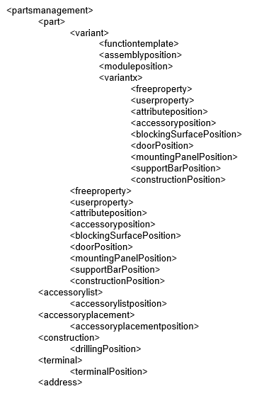

# Импорт и экспорт XML: Обзор тэгов и атрибутов

Импорт и экспорт базы данных изделий происходит при помощи языка XML. Данные в соответствии с этим языком должны быть структурированы следующим образом:

!!! note "Замечание:"

    * Тег <partsmanagement> можно определить только один раз! Все остальные теги могут быть определены любое количество раз. Их определение также можно опустить, например, если необходимо задать шаблон функции или схему сверления без указания данных.
        Исключение:
        Для изделия (тег <part>) всегда должен быть задан как минимум один вариант (тег <variant>)!
    * Тег <variantx> расположенный под тегом <variant> имеет свойства (атрибуты), которые до версии 2022 были присвоены только изделию (тег <part>), а теперь зависят от варианта. Тег <variantx> может использоваться только со второго варианта, и он отличается от первого варианта.
        Исключение:
        атрибут P_ARTICLE_PARTNR (номер изделия) можно определить только для тега <part> .

### Тэги

[<partsmanagement>](xmlexport_o_tags.htm#partsmanagement)
---
[ <part>](xmlexport_o_tags.htm#part)
[<variant>](xmlexport_o_tags.htm#variant)
[<variantx>](xmlexport_o_tags.htm#variantx)
[<functiontemplate>](xmlexport_o_tags.htm#functiontemplate)
[<freeproperty>](xmlexport_o_tags.htm#freeproperty)
[<blockingSurfacePosition>](xmlexport_o_tags.htm#blockingSurfacePosition)
[<doorPosition>](xmlexport_o_tags.htm#doorPosition)
[<mountingPanelPosition>](xmlexport_o_tags.htm#mountingPanelPosition)
[<supportBarPosition>](xmlexport_o_tags.htm#supportBarPosition)
[<assemblyposition>](xmlexport_o_tags.htm#assemblyposition)
[<moduleposition>](xmlexport_o_tags.htm#moduleposition)
[<attributeposition>](xmlexport_o_tags.htm#attributeposition)
[<accessoryposition>](xmlexport_o_tags.htm#accessoryposition)
[<accessorylist>](xmlexport_o_tags.htm#accessorylist)
[<accessorylistposition>](xmlexport_o_tags.htm#accessorylistposition)
[<construction>](xmlexport_o_tags.htm#construction)
[<drillingPosition>](xmlexport_o_tags.htm#drillingPosition)
[<terminal>](xmlexport_o_tags.htm#terminal)
[<terminalPosition>](xmlexport_o_tags.htm#terminalPosition)
[<safetyRelatedValuePosition>](xmlexport_o_tags.htm#safetyRelatedValuePosition)
[<address>](xmlexport_o_tags.htm#address)
