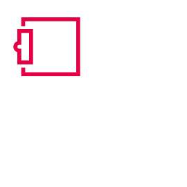

# Платформа Eplan

- { width="18" } [Проекты](projects_k_start.md)
- { width="18" } [Графический редактор](gededitgui_k_start.md)
- { width="18" } [Центр вставки](insertergui_k_start.md)
- { width="18" } [Макросы](macrosgui_k_start.md)
- { width="18" } [Соединения](connectionbrowsergui_k_start.md)
- { width="18" } [Отчеты](formgeneratorgui_k_start.md)

Company

* [About us](https://www.eplan-software.com/company/portrait/about-us/ "About us")
* [Career](https://www.eplan-software.com/company/career/ "Career")
* [Locations](https://www.eplan-software.com/company/locations/ "Locations")
* [Contact](https://www.eplan-software.com/company/contact/ "Contact")
* [Events](https://www.eplan-software.com/company/events/ "Events")

Solutions

* [ EPLAN Platform](https://www.eplan-software.com/solutions/eplan-platform/ "EPLAN Plattform")
* [ EPLAN Education](https://www.eplan-software.com/solutions/eplan-for-educational-institutions/ "EPLAN Education")
* [ EPLAN Data Portal](https://www.eplan-software.com/solutions/eplan-epulse/eplan-data-portal/ "EPLAN Data Portal")
* [ User reports](https://www.eplan-software.com/industries/user-reports/ "User reports")

For customers (Login)

* [ EPLAN Global Support ](https://www.eplan-software.com/services/eplan-global-support/ "EPLAN Global Support")
* [ Downloads ](https://www.eplan-software.com/services/downloads/ "Downloads")
* [ Trainings ](https://www.eplan-software.com/services/training/ "Trainings")
* [ EPLAN Information Portal ](https://www.eplan.help/de-de/Infoportal/Content/htm/portal_home.htm "EPLAN Information Portal")
* [ EPLAN Cloud](https://identityservice.eplan.cloud/epulse/signup "EPLAN Cloud")

Legal information

* [ Legal notice ](https://www.eplan-software.com/company/portrait/about-us/legal-information/legal-notice/ "Legal notice")
* [ Privacy policy ](https://www.eplan-software.com/company/portrait/about-us/legal-information/privacy-policy/ "Privacy policy")
* [ Code of Conduct ](https://www.eplan-software.com/company/portrait/about-us/legal-information/code-of-conduct/ "Code of Conduct")
* [ Terms & Conditions ](https://www.eplan-software.com/company/portrait/about-us/legal-information/terms-conditions/ "Terms & Conditions")
